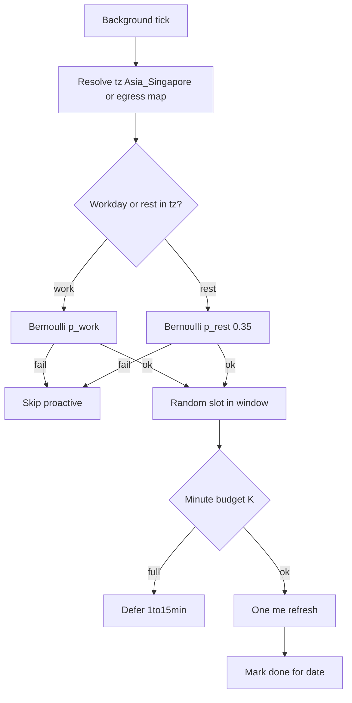

# 反代生图/聊天拟人化与容量方案（v2.2 · 可落地）

最后更新：2026-07-18（日历 **Asia/Singapore**；含吞吐对照与降封天花板）  
状态：**方案 v2.2 定稿；Phase A–C 代码已实现；Panda 配置 Phase A+B 已开；Phase D 默认 shadow；Hard Mode 未启用**  
关联：[`docs/09-outlook-longevity-99-plan.md`](09-outlook-longevity-99-plan.md)（账号存活总案；节点地区 SG/SIN）

本文覆盖：行为拟人、带波动容量、SG 探活、性能参数、**现网/v2.1/Hard 吞吐对照**、**降封估计与天花板**、Phase A–D。

### 落地快照（Panda · 2026-07-18）

| 项 | 值 |
|----|-----|
| 备份 | `/root/gptimage/config.phaseA-before-20260718-101054.json` |
| `account_maintenance_loop.enabled` | **false** |
| `outlook_auto_recovery.enabled` | **false** |
| `submit_start_min_interval_ms` | **5000** |
| `scheduler.enabled` | **true**（base=60，ratio=0.7，抖动默认） |
| `proactive_refresh.enabled` | **true**（`Asia/Singapore`，`p_rest=0.35`） |
| `workload.mode` | **shadow**（`auto_live_min_ready=0`；D≥10 后再开） |
| Hard Mode | **未启用** |
| 代码 | 本地已齐：见下表「实现对照」；生产需 **git push → panda pull → 重启** 同步 |

### 实现对照（代码 vs 生产）

| 能力 | 代码 | Panda 配置/运行 |
|------|------|-----------------|
| 关 maintenance / recovery | ✓ | ✓ 已关 |
| 账号 gap + soft band | ✓ | ✓ scheduler on |
| SG 日历探活 + `p_rest` | ✓ | ✓ |
| 夜间/午餐选号软权重 | ✓ 取号排序 | 随代码部署 |
| `timezone_from_egress` | ✓ | 配置 true；随代码部署 |
| 文本间隔门禁 | ✓ | 随代码部署 |
| `cooldown_429` | ✓ 上游 429 接线 | 随代码部署 |
| 全局 submit ×Uniform(0.7,1.3) | ✓ | 随代码部署 |
| `C_g=max(configured,D)` auto | ✓ | 随代码部署 |
| fail_streak / cohort / 新号 0.4× | ✓ | 随代码部署 |
| soft band（**不改 status**；仅 `image_soft_capped`） | ✓ 2026-07-18 修复卡死 | 随代码部署 |
| Phase C resume 退避 + 总墙取消 | ✓ | 随代码部署 |
| prompt 短窗去重 | ✓ | 随代码部署 |
| Phase D workload live | ✓（`mode` / `auto_live_min_ready`） | **保持 shadow** |
| Hard Mode 常数 | 文档可选 | **不改默认** |

---

## 0. 边界

1. OpenAI ToS 禁止 programmatic extract / 绕过防护。本方案只降低可检测信号、拉长号寿命，不是合规官方用法。
2. 纯协议反代过不了完整 Sentinel/Turnstile/React 水合；拟人重点在**调度与探活日历**，不堆假头、不造鼠标轨迹。
3. **没有**「100% 不被封」参数；**禁止**把单一「总封号率 −X%」当保证（见 §5）。
4. 探活/办公日历跟**账号 sticky 出口地区**，当前 Webshare 池为 **SG → `Asia/Singapore`**，不用运维人本地 `Asia/Shanghai` 标签。
5. 2026-07-18 Panda 池面多数废/透支；Phase A 可立刻减噪声，吞吐放大依赖号池回补。

---

## 1. 证据层级（权威位）

| 层级 | 内容 | 用法 |
|------|------|------|
| **L0 硬约束** | ToS；禁回潮：`post_ready=15`、estuary 无 Bearer | 永久红线 |
| **L1 本仓实证** | kev T&S；额度透支；无密码 recovery 噪声；生图 ~73s；Panda config；节点 SG/SIN | 参数校准 |
| **L2 一阶行为原则** | 单号串行；间隔+抖动；额度软熔断；一号一出口；日历探活；失败即停；真实任务驱动 | 设计主轴 |
| **L3 过时仓库备忘** | gpt2api / 远古 chat2api 系 | **不得当参数真理** |

建议起点：图 `base=60s`、日用量 soft `0.70`、工作日探活 `p_work≈1`、休息日 `p_rest=0.35`。

---

## 2. 容量公式（含波动）

### 2.1 符号

| 符号 | 含义 |
|------|------|
| `D` | 可调度生图账号数 |
| `C_a` | 单号并发 = **1** |
| `C_g` | `image_global_concurrency` |
| `W` | 单次墙钟 p50（观察号 ≈70–75s） |
| `base` / `gap` | 间隔基线 / 含抖动实际间隔 |

### 2.2 单号间隔（禁止固定 60.000s）

```text
base  = image_min_interval_sec           # 建议 60
j     = Uniform(0.65, 1.45)
extra = ExtraPoisson(λ)                  # λ≈8s（图）；文 λ≈5
gap   = base * j + extra
next_ok_at = last_submit_at + gap

E[gap] ≈ 60 * 1.05 + 8 ≈ 71s
```

全局过渡：`submit_gap_ms = submit_start_min_interval_ms * Uniform(0.70, 1.30)`（A 基线 5000）。

### 2.3 吞吐

```text
峰值在飞 ≈ min(D × C_a, C_g, 出口能力)
E[张/小时] ≈ D × 3600 / max(E[gap], W_p50)
验收：吞吐 ∈ [0.75, 1.15]×E；在飞 ∈ [0.7D, D] 且 ≤ C_g
```

| D | E[张/小时]（W=70） | 在飞目标 |
|---|-------------------|----------|
| 10 | ≈514 | 7–10 |
| 50 | ≈2571 | 35–50 |
| 100 | ≈5143（须 `C_g≥100`） | 70–100 |

### 2.4 日熔断软带

```text
peak 随 remaining/reset_after 窗口更新
used_ratio = 1 - remaining / max(peak, 1)
band = Uniform(soft-0.05, soft+0.03)     # soft=0.70 → ≈0.65…0.73
used_ratio >= band → 本窗停图；remaining<=0 硬停
```

禁止写死固定「日额度=50」。

### 2.5 续优化：业务时段软偏好（可选，Phase B+）

在 **SG 本地** 降低「半夜齐射」味道（不砍跨时区真实用户硬需求）：

```text
hour = now(Asia/Singapore).hour
# 主动探活：仅落在工作/休息窗（§3）——已强制
# 生图调度软权重（不拒绝，只降低选号优先级）：
若 hour ∈ [00,06): score *= 0.4
若 hour ∈ [12,13]: score *= 0.85          # 午餐浅谷
否则 score *= 1.0
```

真实排队任务**永不丢弃**；仅影响多候选时的选号偏好。

---

## 3. 探活日历（新加坡代理时区 · 休息日非零）

### 3.1 现网问题（2026-07-18）

| 组件 | 实读 | 问题 |
|------|------|------|
| maintenance | on / 300s / stale 12h | 机械齐刷 |
| outlook_auto_recovery | on / 1800s | 无密码 CSRF/OTP |
| refresh_account_interval_minute | 360 | 固定 6h |

### 3.2 时区解析

```text
tz = map_egress_region_to_tz(account.proxy_egress_region 或节点地区)
# 当前池 Webshare SG/SIN → Asia/Singapore
# 未知地区 → 默认 Asia/Singapore（与 09 节点基线一致）
# 禁止用运维主机本地 Shanghai 覆盖出口语义
```

### 3.3 日历参数（默认）

| 项 | 工作日 | 休息日（Sat/Sun；v1 不含法定假） |
|----|--------|----------------------------------|
| 时区 | `Asia/Singapore` | 同左 |
| 窗 | 09:00–17:00（8h） | 10:00–16:00（6h） |
| 日触发概率 | `p_work = 1.0`（可调 0.85–1.0） | **`p_rest = 0.35`**（可调 0.25–0.45） |
| 每号每日上限 | 1 次 proactive | 若触发则仍 ≤1 次 |
| 分钟帽 K | 2 | **1** |
| 事件驱动 `/me` | 不受限（AT 将过期、真实 preflight） | 同左 |

```text
seed = hash(token_hash|email_norm, YYYY-MM-DD@tz, salt)
u = (seed mod 1e9) / 1e9
p_day = p_work if workday else p_rest
若 (seed2 / 1e9) >= p_day: 今日不主动刷；return

W0,W1 = 当日窗起止（工作或休息）
slot = W0 + u*(W1-W0) + Uniform(-10min,+10min)  # 钳入窗
due = now>=slot AND 当日未 proactive_done
若本分钟已刷满 K: 顺延 Uniform(1,15) min
```



**量级（N=100）：** 工作日 ≈100 次散落 8h；休息日期望 ≈35 次散落 6h；峰值每分钟 ≤K。相对 300s 机械环，数量级下降且无整点齐射。

### 3.4 续优化：失败熔断与入池错峰

| 规则 | 公式 / 行为 | 目的 |
|------|-------------|------|
| 单号连续失败 | `fail_streak≥3` → 冷却 `Uniform(30,90)min`；禁止立即换号打穿 | 降失败风暴 |
| cohort 保护 | 同 `cohort_id` 短窗 terminal≥阈值 → 整批暂停新图 | 防波次打死 |
| 新号成熟 | 对齐 09：观察窗内不进 live；首周图配额 `min(band, 0.4×peak)` | 降新号猝死 |
| 指纹/locale | UA/locale/tz 与 **SG 出口**一致；禁止上海墙钟 + SG IP 硬拧 | 降身份矛盾 |

---

## 4. 落地后性能与参数总表

### 4.1 配置常数

| 键 / 概念 | 建议值 | 阶段 |
|-----------|--------|------|
| `image_account_concurrency` | 1 | A |
| `image_global_concurrency` | `max(10, D)` | A |
| `submit_start_min_interval_ms` | 5000 → 后 1500–3000 | A→B |
| `scheduler.image_min_interval_sec` | 60 + 抖动 | B |
| `scheduler.text_min_interval_sec` | 30 + 抖动 | B |
| `scheduler.jitter_lo/hi` | 0.65 / 1.45 | B |
| `scheduler.extra_poisson_lambda_sec` | 8（图）/ 5（文） | B |
| `scheduler.daily_usage_ratio` | 0.70 + soft band | B |
| `scheduler.cooldown_429_sec` | 900 | B |
| `proactive_refresh.timezone` | **`Asia/Singapore`**（或 egress map） | B |
| `proactive_refresh.p_work` | 1.0 | B |
| `proactive_refresh.p_rest` | **0.35** | B |
| `proactive_refresh.window_work` | 09:00–17:00 | B |
| `proactive_refresh.window_rest` | 10:00–16:00 | B |
| `proactive_refresh.minute_cap_k` / `k_rest` | 2 / 1 | B |
| `account_maintenance_loop.enabled` | false → 日历替代 | A/B |
| `outlook_auto_recovery.enabled` | false | A |
| `workload.mode` | shadow→live | D |
| resume | 首≥5s+jitter；指数≤60s；总墙 180–300s | C |

### 4.2 延迟

| 指标 | 现网 | 落地后 |
|------|------|--------|
| 单次生图墙钟 | ≈73s | **基本不变**（上游主导） |
| 同号第 2 张附加 | ≈0 | ≈ max(0, gap−W) |
| 跨号并行 | 受 C_g | 仍靠 D×1 |
| 探活抢锁 | maintenance 批 | 日历打散；休息日更稀 |

### 4.3 吞吐与探活 QPS

| 指标 | 目标 |
|------|------|
| E[张/小时] | `D×3600/max(E[gap],W)` |
| 工作日 proactive | ≈ `N×p_work` / 8h；峰 ≤ K/60 |
| 休息日 proactive | ≈ `N×p_rest` / 6h；峰 ≤ 1/60 |
| maintenance 批日志 | A 后 → 0 |

### 4.4 NewAPI

真实任务驱动；admission 满则 429/入队；失败有限重试；禁止假聊天。

### 4.6 吞吐对照（现网 vs v2.1 vs Hard Mode）

约定：`C_a=1`，`W_p50=70s`，免费窗举例 `peak≈25` 张/号/日；  
`E[gap]_v21≈71s`；Hard 中档 `base=105` → `E[gap]_hard≈118s`；Hard 日带 `≈0.52`。

```text
R_h/号 = 3600 / max(E[gap], W)
R_pool = min(D, C_g) * R_h
R_d/号 ≈ peak × usage_frac    # 现网≈1.0；v2.1≈0.70；Hard≈0.52
```

**单号**

| 档位 | 有效间隔 | 小时张/号 | vs 现网小时 | 日张/号 (peak=25) | vs 现网日 |
|------|----------|-----------|-------------|-------------------|----------|
| 现网（无账号 gap，打满额度） | ≈70s | ≈51.4 | 基准 | ≈25 | 基准 |
| **v2.1（默认推荐）** | ≈71s | ≈50.7 | **约 −1%** | ≈17.5 | **约 −30%** |
| **Hard Mode（可选）** | ≈118s | ≈30.5 | **约 −41%** | ≈13 | **约 −48%** |

**池小时（现网 `C_g=10` 会帽死大池；方案建议 `C_g=max(10,D)`）**

| D | 现网 C_g=10 | v2.1 仍 C_g=10 | v2.1 且 C_g=D | Hard 且 C_g=D |
|---|-------------|----------------|---------------|---------------|
| 10 | ≈514 | ≈507（≈−1%） | ≈507 | ≈305（≈−41%） |
| 50 | ≈514（帽死） | ≈514 | ≈2535 | ≈1525 |
| 100 | ≈514（帽死） | ≈514 | ≈5070 | ≈3050 |

**池日合计（D×peak25，吃满日带）**

| D | 现网 | v2.1（×0.70） | Hard（×0.52） |
|---|------|---------------|---------------|
| 10 | 250 | 175（−30%） | 130（−48%） |
| 50 | 1250 | 875（−30%） | 650（−48%） |
| 100 | 2500 | 1750（−30%） | 1300（−48%） |

**读法（已接受为默认口径）：**

- v2.1：**小时速率几乎不降**；**日产出约 −30%**（软熔断）。  
- Hard：小时约 **−35～45%**；日约 **−45～55%**。  
- 把 `C_g` 提到 D 是去掉错误全局帽，不是拟人代价；大池小时吞吐可因此上升。

---

## 5. 降封 / 降识别：估计与验收（禁止伪精确总 %）

### 5.1 不能承诺的

T&S 黑盒；「批量 Outlook + Web 反代生图」本身高危。**不得**宣传「总封号率下降 XX%」为保证。

### 5.2 分信号工程估计（相对「机械刷 + 透支 + 失败狂重试」基线）

| 信号类 | 手段 | 该类相对降幅（估计） | 强度 |
|--------|------|----------------------|------|
| 机械 `/me` 齐刷 | 关 loop + SG 日历 | **约 60–90%** | 强 |
| recovery 无密码噪声 | 关掉 | **约 80–100%** | 强 |
| 同号高频/整秒对齐 | gap 抖动 | **约 40–70%** | 中 |
| 额度透支 | soft band | **约 70–95%** | 强 |
| 真浏览器 Sentinel | 本方案不碰 | **≈0%** | 强 |
| 批量反代生图业务模式 | 无法消除 | **约 0–20%** | 弱 |
| 同波次扩散 | cohort / 新号限额 | **约 20–40%** | 中 |

**合成直觉（非正式、非承诺）：** 对「自己造的自动化痕迹」，认真落地后总风险大约 **降 30–50%**；**不要期望总封号率降 70%+**。

### 5.3 可测代理指标（14–28 天对照，同供应商出口）

1. 工作日 proactive ≈ `N×p_work`（±20%）；休息日 ≈ `N×p_rest`（±25%）  
2. 提交间隔分布无固定秒尖刺  
3. `remaining < 0` → 0  
4. 无密码号 recovery 尝试 → 0  
5. 协议：`post_ready15` ABSENT；estuary 带 Bearer  
6. 描述性：cohort terminal 率（不作绝对 SLO）

### 5.4 最大降封天花板与 Hard Mode

| 路径 | 总封号风险直觉降幅 | 吞吐代价（见 §4.6） |
|------|-------------------|-------------------|
| **v2.1（默认）** | **约 30–50%** | 小时 ≈0～−2%；日 ≈−30% |
| **Hard Mode** | **约 45–60%**（再抬有限） | 小时 ≈−35～45%；日 ≈−45～55% |
| 同形态下 ≥70% | **不现实** | — |
| 换产品形态（官方 API 等） | 才可能再高 | 非本调度方案 |

Hard Mode 加码（可选，用吞吐换余量）：

1. `daily_usage_ratio` → **0.50～0.55**  
2. 图 `base` → **90～120s**，抖动加宽  
3. `p_rest` → **0.15～0.20**  
4. 新号 7d 极少图；`fail_streak≥2` 长冷却；cohort 一封停批  
5. 同 prompt 短窗去重；全局失败率熔断暂停接单  
6. `C_g ≤ 健康 D`；宁可排队不齐射  

默认仍推 **v2.1 平衡档**；Hard 仅在明确接受 §4.6 代价后启用。

---

## 6. 本仓 / Panda 对照

**路径：** `/root/gptimage/config.json`

| 项 | 2026-07-18 实读 | 评价 |
|----|-----------------|------|
| 单号并发 | 1 | OK |
| 全局并发 | 10 | D 升后上调 |
| submit 间隔 | 1500ms | A→5000 |
| maintenance / recovery | 均 on | A 关 |
| 账号 gap / 日熔断 / SG 日历 | 无 | B |
| workload | shadow | D 再开 |

复用：`_image_inflight`、`last_used_at`（缺门禁）、sticky binding、`account_workload_policy` shadow。

---

## 7. 分阶段落地

### Phase A — 配置

```json
{
  "account_maintenance_loop": { "enabled": false },
  "outlook_auto_recovery": { "enabled": false },
  "image_task_queue": { "submit_start_min_interval_ms": 5000 },
  "image_account_concurrency": 1
}
```

AC：无 maintenance/recovery 批噪声；isolation 保持。

### Phase B — 代码

```json
{
  "scheduler": {
    "image_min_interval_sec": 60,
    "text_min_interval_sec": 30,
    "jitter_lo": 0.65,
    "jitter_hi": 1.45,
    "extra_poisson_lambda_sec": 8,
    "daily_usage_ratio": 0.70,
    "cooldown_429_sec": 900,
    "night_soft_weight": 0.4,
    "lunch_soft_weight": 0.85
  },
  "proactive_refresh": {
    "enabled": true,
    "timezone": "Asia/Singapore",
    "timezone_from_egress": true,
    "p_work": 1.0,
    "p_rest": 0.35,
    "window_work": ["09:00", "17:00"],
    "window_rest": ["10:00", "16:00"],
    "per_account_per_day": 1,
    "minute_cap_k": 2,
    "minute_cap_k_rest": 1,
    "slot_jitter_minutes": 10
  }
}
```

钩子：取号前 gap 门禁；peak/band 熔断；日历替换 maintenance；失败冷却 + 新号限额（§3.4）。

AC：间隔 ≥0.55×base；工作日/休息日 proactive 贴合 p_work/p_rest；透支停；in-flight≤min(D,C_g)。

### Phase C — resume 退避与取消  
### Phase D — workload live（D≥10 且 B 稳；现网不开）

### 可选：Hard Mode 档

Phase B 稳定后，若接受 §4.6 / §5.4 代价，再把 `scheduler` / `proactive_refresh` 收到 Hard 常数；**不作为默认上线档**。

---

## 8. 明确不做

- 协议回潮；假聊天/假鼠标  
- 单一「总封号率 −X%」营销承诺；同形态下承诺 ≥70% 总降幅  
- L3 过时仓库当真理；panda 上 build / scp 正式发布  

---

## 9. 与封号实证对齐

| 现象 | 对应 |
|------|------|
| T&S deactivated | cohort 停；无法报文挽回 |
| 透支 | soft band + 硬停 |
| recovery 噪声 | A 关 |
| 机械 maintenance | A 关 → B SG 日历 |
| 身份/出口矛盾 | tz/locale 跟 SG |

---

## 10. 参考

L0–L2 本仓证据；09 节点 SG/SIN；`config.py` / `account_service.py` / `image_task_service.py` / `account_maintenance_loop_service.py`。L3 仅备忘。

---

## 11. 下一步

1. ~~Phase A~~ **已落地**（Panda 配置 + 重启 + health）。  
2. ~~Phase B 核心~~ **已落地**（scheduler gap/soft band + SG 日历探活）。  
3. ~~Phase B 续优化 + Phase C~~ **代码已实现**（软权重 / egress tz / 文本间隔 / 429 / submit 抖动 / C_g 自动 / fail·cohort·新号 / resume 退避+总墙 / prompt 去重）；待 **正式 git 部署** 到 Panda。  
4. Phase D：`workload.mode=live` 或 `auto_live_min_ready=10`（**D≥10 且 B 稳后再开**；现网保持 shadow）。  
5. 14–28 天按 §5.3 代理指标对照。

生产变更已做：见文首「落地快照」。Hard Mode 未启用。
