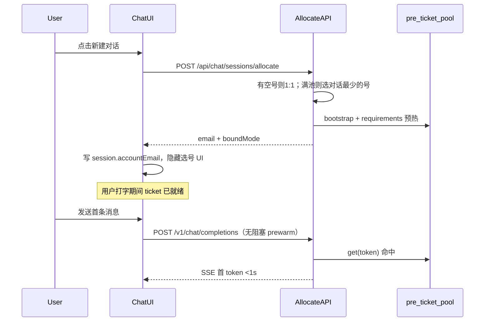
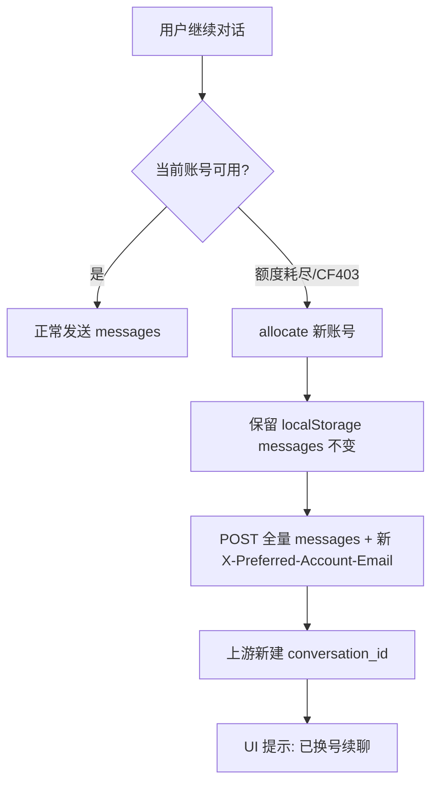
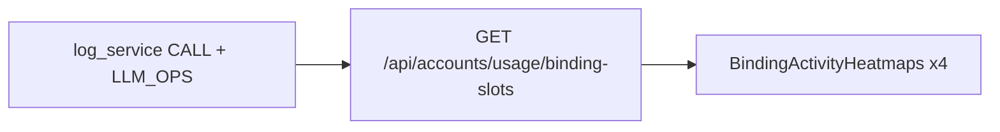

# 对话页优化方案（检查结论 + 可执行计划）

最后更新：**2026-07-27（决策修订）**  
已确认：**有空号 1:1 / 满池最少负载 / 全失败降级**；**persist+reuse 默认开 + 14 天上游清理**；**并发目标 30**；手机 drawer 后期。

---

## 总览

| # | 需求 | 结论 | 优先级 |
|---|------|------|--------|
| 1 | 取消选号，新建即绑定+预热 | **可行**，首句 TTFT 可争取 <1s，需后端分配 API | P0 |
| 2 | 后续仍 2–5s | **可优化到 0.5–1.5s**，根因已定位 | P0 |
| 3 | 隐藏滚动条 | **纯 CSS**，低风险 | P1 |
| 4 | 侧栏收起 | **可行**，参考 OpenAI 左贴边动画 | P1 |
| 5 | 切换会话卡顿 / 代码块识别 | **可优化**，虚拟列表 + 高亮策略 | P1 |
| 6 | 跨账号续记忆 | **不必走 MD 导出**，客户端重放更优 | P0 逻辑 / P2 产品 |
| 7 | IP 日历热力图空白 | **组件用途搞错了**；改 4 路活动热力图 | P1 |

---

## 已确认决策（2026-07-27）

| 项 | 决定 |
|----|------|
| allocate 全失败 | **降级**：退回自动轮询选号，不排队、不硬报错 |
| 有空闲号 | **1:1** 独占 |
| 无空闲号（对话数 ≥ 可用号数） | 绑到**当前对话数最少**的号；并列则轮询 |
| persist + reuse | **默认打开**（全局 + 新 allocate 账号） |
| 上游会话寿命 | **14 天**；到期删 OpenAI 侧记录 + 清 `text_conversation_id`；本地 localStorage 保留 |
| 到期提醒 | 前 3 天 / 1 天横幅：**请及时导出 md/txt** |
| 并发设计容量 | **30** 路同时活跃对话 |
| 手机侧栏 drawer | **后期**，本期仅桌面收起 |
| 上游请求 | **不新增**自定义 header |

**号池缺口：** Panda 现约 **17** 账号；30 并发下 **13+ 路必然多对话共号**（最少负载策略）。长期 30 并发需**扩号池**，否则接受共号。

---

## 1. 取消选号 + 新建即绑定预热

### 现状

- 账号下拉在 [`web/src/app/chat/conversation-workbench.tsx`](../web/src/app/chat/conversation-workbench.tsx) 底部工具栏
- `createSession()` 只在 localStorage 建空会话，**不分配账号**（[`session-store.ts`](../web/src/app/chat/session-store.ts)）
- 预热在「有 email 后」才触发；发送前还有 `await prewarmChatAccount`，阻塞首条消息

### 目标架构



### 后端改动

| 步骤 | 文件 | 内容 |
|------|------|------|
| B1 | 新建 `api/chat_sessions.py` 或扩 `api/ops.py` | `POST /api/chat/sessions/allocate`：调用 `account_service.get_text_access_token()` 选号；返回 `email`；可选 `lease_id` |
| B2 | `services/account_service.py` | 新增 `allocate_text_session()`：维护 `email → active_chat_count`；**有空号 → 1:1**；**满池 → min(active_chat_count)**；统计在 allocate/release 时增减 |
| B3 | `api/ops.py` `chat_prewarm` | allocate 内联调用；结果写入 `pre_ticket_pool` |
| B4 | allocate 响应 | 返回 `{ email, mode: "exclusive" \| "shared" \| "degraded" }`；`degraded` = 无租约，走 `get_text_access_token()` 自动调度 |
| B5 | 配置 | `text_chat_session_lease_ttl_secs`（建议 30min，仅 exclusive 模式）；进程重启重建计数 |

### 前端改动

| 步骤 | 文件 | 内容 |
|------|------|------|
| F1 | `session-store.ts` | `createSession` 改为 async：先 allocate，再写 `accountEmail` |
| F2 | `conversation-workbench.tsx` | 移除账号下拉与 `preferredEmail` 手动选择 UI |
| F3 | `conversation-workbench.tsx` | 发送路径去掉 `await prewarm`（allocate 已预热；保留 90s keepalive 后台跑） |
| F4 | `lib/api.ts` | 新增 `allocateChatSession()` |

### 资源占用评估（多用户）

| 维度 | 估算 | 说明 |
|------|------|------|
| `pre_ticket_pool` 内存 | ~数 KB/账号 | 按 `access_token` 一条，TTL 120s；100 并发 ≈ 可忽略 |
| CPU | 主要在开新会话时 | bootstrap + Turnstile 解题；1:1 下每新会话 1 次，非每消息 |
| 账号消耗 | **线性于活跃会话数** | 1:1 比热池轮询更快耗尽号池；需监控 `text_next_ok_ts` |
| 前端 timer | N 会话 × 90s interval | 同号多会话会去重为 1 个 keepalive（绑定后 email 固定） |

**绑号算法（伪代码）：**

```
candidates = 文本可用账号（非禁用、过冷却、CF 可用）
if 存在 email 且 active_chat_count[email]==0:
    返回该号，mode=exclusive
else if candidates 非空:
    返回 argmin(active_chat_count)，mode=shared
else:
    降级 get_text_access_token()，mode=degraded
```

**降级**：`mode=degraded` 时不保证预热；发送仍可用，首句可能慢。仅当 `get_text_access_token()` 也返回空时才报错。

---

## 2. 后续消息仍 2–5s 的原因与优化

### 根因（按影响排序）

| 优先级 | 瓶颈 | 位置 | 典型耗时 |
|--------|------|------|----------|
| P0 | 发送前 `await prewarmChatAccount` | `conversation-workbench.tsx` L569 | 0.5–3s |
| P0 | `_prepare_text_conversation` 每轮必调 | `openai_backend_api.py` L4162 | 0.3–1.5s |
| P0 | `_get_chat_requirements` pool miss | `openai_backend_api.py` L4628 | 1–4s（含 Turnstile） |
| P1 | 全量 `messages[]` 重传 | 前端 + `build_chat_body` | 随历史增长 |
| P1 | 默认不续聊上游 `conversation_id` | `text_chat_reuse_conversation=false` | 每轮新会话 + 全历史 |
| P2 | CF 403 重试 | requirements / conversation | 0.35s × attempt |

### 优化方案

#### 2.1 去掉发送前阻塞 prewarm（P0，前端）

```typescript
// 改前：await prewarmChatAccount(prewarmEmail)
// 改后：仅后台 keepalive；发送时不 await
void prewarmChatAccount(prewarmEmail).catch(() => null);
```

预期节省：**0.5–3s/轮**。

#### 2.2 prepare 结果缓存（P0，后端）

在 `pre_ticket_pool` 或新 `chat_prepare_cache` 中，按 `(access_token, conversation_id|hash)` 缓存 prepare 响应，TTL 60–120s。

- 同会话 follow-up 跳过 `_prepare_text_conversation`
- 文件：`services/openai_backend_api.py` `_prepare_text_conversation` 入口加 cache get/put

预期节省：**0.3–1.5s/轮**（热路径）。

#### 2.3 同账号上游续聊 — **默认打开**（已确认）

全局配置（`config.json`）：

```json
{
  "text_chat_persist_history": true,
  "text_chat_reuse_conversation": true
}
```

allocate 时为新号写入 `chat_persist_history` / `chat_reuse_conversation`；`stream_conversation` 使用 `history_and_training_disabled=false`（与养号文档一致）。

效果：后续轮次带 `conversation_id` + `parent_message_id`，上游按官网逻辑续聊，follow-up 更快。

相关代码：`remember_text_conversation`（`account_service.py` L2855）、`stream_conversation`（`openai_backend_api.py` L4128）。

#### 2.3.1 上游会话 14 天过期（新增）

| 步骤 | 内容 |
|------|------|
| E1 | 账号记录增加 `text_conversation_created_at`（首次拿到 `conversation_id` 时写入） |
| E2 | 后台定时任务（如每日）：`created_at + 14d < now` → 调上游删除 API → 清空 `text_conversation_id` / `text_parent_message_id` |
| E3 | **上游删除接口**：需从协议目录/HAR 补齐（当前代码库无现成实现）；失败则重试 + 日志，不删本地 localStorage |
| E4 | 前端：`conversation-workbench` 根据 `upstreamExpiresAt` 显示「还剩 N 天，请导出」横幅（3 天 / 1 天） |

**用户侧**：14 天后 OpenAI 不再保留该线程；浏览器里导出的 md/txt 和 localStorage 历史仍在。

#### 2.4 requirements 与 chat 并行（P1，后端）

`stream_conversation` 中若 pool miss，用 `ThreadPoolExecutor` 并行：

- `submit(_get_chat_requirements)`
- `submit(_prepare_text_conversation)`（在 requirements 回调后）

已有生图路径类似模式（L2619），文本路径可对齐。

#### 2.5 验收指标

```bash
# Panda 容器内
uv run python scripts/_tmp_bench_chat_ttft.py --base http://127.0.0.1:80 --rounds 5
```

| 场景 | 当前 | 目标 |
|------|------|------|
| 冷启动首句 | 5–10s | <2s（allocate 已预热） |
| 热路径首句 | 0.03–2s | <0.5s |
| follow-up（第 2–5 轮） | 2–5s | **0.5–1.5s** |
| CF 403 换号 | 5–15s | 保持现有 failover |

---

## 3. 隐藏滚动条（保留滚动）

### 现状

- 会话列表侧栏：**已隐藏**滚动条（`[scrollbar-width:none]` 等）
- 消息主区：**仍显示**系统滚动条

### 方案

在 `globals.css` 已有 `.hide-scrollbar` 工具类；对消息区 `messagesScrollRef` 容器应用：

```tsx
className="... overflow-y-auto hide-scrollbar"
```

或全局 chat 作用域：

```css
.chat-messages-scroll {
  scrollbar-width: none;
  -ms-overflow-style: none;
}
.chat-messages-scroll::-webkit-scrollbar {
  display: none;
}
```

**注意**：仅视觉隐藏，不影响滚轮/触摸/键盘滚动。  
**文件**：`conversation-workbench.tsx` 消息区 div；可选 `globals.css`。

---

## 4. 左侧会话栏可收起（OpenAI 风格）

### 现状

- 布局：`grid lg:grid-cols-[300px_minmax(0,1fr)]`，**无折叠**
- 对比：`image-workbench.tsx` 有移动端 Dialog，chat 未实现

### 方案

| 步骤 | 内容 |
|------|------|
| S1 | 新增状态 `sidebarCollapsed`，持久化到 `localStorage`（`gptimage.chat.ui.v1`） |
| S2 | 根布局改为：`transition-[grid-template-columns] duration-300 ease-in-out` |
| S3 | 展开：`lg:grid-cols-[260px_minmax(0,1fr)]`；收起：`lg:grid-cols-[0_minmax(0,1fr)]` 或 `[52px_...]` 仅留图标轨 |
| S4 | 收起按钮贴**布局最左侧**（`fixed left-0 top-1/2` 或 header 内左缘），图标 `PanelLeftClose` / `PanelLeftOpen` |
| S5 | 收起时侧栏 `translate-x-[-100%]` + `overflow-hidden`；主区 `transition-all` 扩满 |
| S6 | `< lg`：保持堆叠或改为 overlay drawer（可选二期） |

**参考动画**：`transform` + `opacity` 200–300ms；避免 `display:none` 打断 transition。

**文件**：`conversation-workbench.tsx`（主改）、可选抽 `chat-sidebar.tsx`。

---

## 5. 切换会话卡顿 + 代码块语言识别

### 现状

- `react-markdown` + `remark-gfm` + `highlight.js`（已注册 c/cpp/python/ts 等 20+ 语言）
- **无虚拟列表**；切换会话全量重渲染 + 全量 Markdown 解析
- `MarkdownBubble` 有 `memo`，但 `components` 对象每次新建削弱效果
- 用户消息不走 Markdown（纯文本）

### 优化方案

| 步骤 | 内容 | 预期 |
|------|------|------|
| M1 | 引入 `@tanstack/react-virtual` 虚拟化消息列表 | 长会话切换从 O(n) DOM → O(可见) |
| M2 | `components` 提到模块级常量，修复 memo | 减少无效重渲染 |
| M3 | 非活跃会话 Markdown **延迟渲染**（`content-visibility: auto` 或切换后 `requestIdleCallback` 高亮） | 切换瞬时 <100ms 感知 |
| M4 | 输入框：可选 `textarea` + 行首 ` ``` ` 检测显示语言角标（仅 UI 提示，发送仍纯文本） | 产品层「识别」 |
| M5 | 助手消息代码块：优先用 fence 声明语言；无声明时 `highlightAuto`（已有） | 已部分支持 |

**语言识别说明**：渲染侧 `highlight.js` 已支持多语言；输入侧若要做「边打边显示语言」，可用轻量规则（`import`/`def`/`fn`/`#include`）或 `highlight.js` 的 `highlightAuto` 抽样，**不建议**上 WASM 完整高亮编辑器（过重）。

---

## 6. 跨账号带记忆续会话

### 结论（不必 MD 导出为主路径）

| 方案 | 可行性 | 保真度 |
|------|--------|--------|
| 跨账号复用 `conversation_id` | ❌ 上游按 token 隔离 | — |
| 换号 + 客户端 `messages[]` 重放 | ✅ **已内置** | 高 |
| Export MD + 附件上传 | ✅ 可行 | 中低（有损） |
| MD/JSON 导入还原 `ChatSession` | ⚠️ 需开发 | 高 |

### 推荐实现（自动换号续聊）



**已有 UI 文案**（`switchAccountNote`）：「换号续聊：将把当前历史发给新号（新开上游对话）」。

### 待开发（P2）

| 项 | 说明 |
|----|------|
| 自动换号 | 403/quota 错误时后端返回 `retry_with_email`；前端自动 allocate 并重试 |
| JSON 导入 | `importSessionFromJson()` 还原 `ChatSession.messages`，用于跨设备 |
| MD 导入 | 解析 `## 你/助手` 分段 → messages（正则，非完美） |
| 历史摘要 | 超长对话换号前 `summarize` 压缩上下文（可选，防 token 超限） |

**不建议**：自动 export MD → upload 附件注入（多一步、有损、512KB 限制）。

---

## 实施顺序（建议 Sprint）

### Sprint A — TTFT（P0，1–2 天）

1. 前端：去掉发送前 `await prewarm`
2. 后端：`prepare` 缓存
3. 配置：文本会话默认 `persist + reuse`
4. 基准：`scripts/_tmp_bench_chat_ttft.py` 前后对比

### Sprint B — 自动绑号（P0，2–3 天）

1. `POST /api/chat/sessions/allocate`（有空 1:1 / 最少负载 / 降级）
2. 前端 `createSession` 改造 + 隐藏选号 UI；`mode=shared` 时可选轻提示「与其他对话共号」
3. Panda 部署 + **并发 30** 会话压测（验证最少负载与降级路径）

### Sprint B+ — 14 天过期（P1，1–2 天）

1. 逆向上游 conversation 删除 API
2. 定时清理任务 + `text_conversation_created_at`
3. 导出提醒横幅

### Sprint C — UI（P1，1–2 天）

1. 消息区隐藏滚动条
2. 侧栏收起动画
3. 虚拟列表 + memo 修复

### Sprint D — 跨账号产品化（P2，按需）

1. 自动换号重试
2. JSON/MD 导入

### Sprint E — 号池 IP 活动热力图（P1，1–2 天）

见下文 **附录 A**。

---

## 关键文件索引

| 文件 | 作用 |
|------|------|
| [`web/src/app/chat/conversation-workbench.tsx`](../web/src/app/chat/conversation-workbench.tsx) | UI 主工作台、prewarm、发送、侧栏布局 |
| [`web/src/app/chat/session-store.ts`](../web/src/app/chat/session-store.ts) | 会话 CRUD、导出 |
| [`web/src/app/chat/code-block.tsx`](../web/src/app/chat/code-block.tsx) | 代码高亮 |
| [`api/ops.py`](../api/ops.py) | `chat_prewarm` |
| [`api/ai.py`](../api/ai.py) | `/v1/chat/completions` |
| [`services/openai_backend_api.py`](../services/openai_backend_api.py) | bootstrap、requirements、prepare、SSE |
| [`services/image_pipeline/pre_ticket_pool.py`](../services/image_pipeline/pre_ticket_pool.py) | requirements 缓存 |
| [`services/account_service.py`](../services/account_service.py) | 选号、`remember_text_conversation` |
| [`scripts/_tmp_bench_chat_ttft.py`](../scripts/_tmp_bench_chat_ttft.py) | TTFT 基准 |

---

## 容量与性能（30 并发）

| 资源 | 30 并发估算 |
|------|-------------|
| 人人 1:1 所需号池 | **≥30** 文本可用号 |
| 现 Panda 约 17 号 | 约 **13 路**走 `mode=shared`（最少负载） |
| 内存（服务端） | pre_ticket + prepare 缓存 **< 500 KB** |
| CPU 稳态 | ~30 次/90s keepalive（同号去重后更少） |
| 新建波峰 | ≤30 次 Turnstile（分散在用户操作时刻） |
| 主要瓶颈 | **号池数量**，非 CPU/内存 |

**扩池建议：** 若业务长期 30 并发且希望尽量 1:1，号池扩至 **35–40**（留 CF/冷却余量）。

---

## 待办（仅剩技术验证）

1. **上游 conversation 删除 API**：协议逆向确认路径与鉴权（Sprint B+ 阻塞项）
2. **Panda 只读统计**：当前文本可用账号数、`text_next_ok` 分布
3. **prepare 缓存失效**：换模型 / 换附件 / 报错 → 强制作废（实施细节，无产品争议）

---

## 相关文档

- 号池性能：[`07-account-pool-performance-upgrade.md`](07-account-pool-performance-upgrade.md)
- CF403：[`17-cf403-and-egress.md`](17-cf403-and-egress.md)
- 文本养号 / persist：[`11-llm-ops-and-text-nurture.md`](11-llm-ops-and-text-nurture.md)
- 前端性能：[`25-frontend-performance-plan.md`](25-frontend-performance-plan.md)

---

## 附录 A — 号池「IP 日历」活动热力图（4 路）

### 问题（为何一片空白）

号池分组视图（`accountViewMode=grouped`）里，IP 组头下的格子图是 [`BindingSgHeatmap`](../web/src/components/accounts/BindingSgHeatmap.tsx)：

- 显示的是 **养号时段权重**（0–1，用来配置「什么时候允许拟人养号」），**不是**生图/对话活动数据。
- 权重为 0 时格子是浅灰 `bg-stone-100`，看起来像「啥也没有」。
- 常见触发：`/api/ops/ip-nurture/presets` 未部署或加载失败 → `nurturePresets=[]` → `weightsForBinding` 得到全 0 矩阵。

用户期望看到的是与顶部「账号流水」图一致的 **4 类真实活动**，按新加坡时区 **7 天 × 12 个 2 小时槽** 分布。

### 目标

每个 **IP 绑定组**（`proxy_binding_hash` / 出口 IP）展示 **4 个只读热力图**：

| 热力图 | 数据键 | 日志来源（与现网统计一致） |
|--------|--------|---------------------------|
| api生图 | `images_api` | CALL：`文生图` / `图生图` |
| 对话生图 | `images_chat` | CALL：`对话生图` |
| 拟人对话 | `dialogues_nurture` | LLM_OPS：`kind=nurture` |
| 真实对话 | `dialogues_real` | CALL：`文本生成` |

**数据对齐规则**：与 [`get_accounts_usage_recent`](../services/account_service.py) / [`get_activity_daily`](../services/account_service.py) 完全同一套分类与成功判定；按 binding 聚合后，各槽计数之和 = 该 binding 下所有邮箱在窗口内的分类总计。

### 架构



### 后端（B-heat）

| 步骤 | 文件 | 内容 |
|------|------|------|
| H1 | `services/account_service.py` | 抽取 `_usage_event_kind(summary, detail, llm_kind) -> metric\|None`，供 recent/daily/binding-slots 共用 |
| H2 | `account_service.get_binding_usage_slots(days=28)` | 扫日志 → 解析 `time` → `Asia/Singapore` 的 `weekday(0=Mon)` + `slot=hour//2` → 按 `binding_key`（邮箱查 `proxy_binding_hash`）累加 4 维 7×12 整数矩阵 |
| H3 | `api/accounts.py` | `GET /api/accounts/usage/binding-slots?days=28`（admin）；60s TTL 缓存 |
| H4 | 响应形状 | `{ days, by_binding: { [key]: { images_api, images_chat, dialogues_nurture, dialogues_real: number[7][12] } } }` |

**时区**：与养号日历一致，`Asia/Singapore`（[`ip_nurture_schedule.py`](../services/ip_nurture_schedule.py)）。

### 前端（F-heat）

| 步骤 | 文件 | 内容 |
|------|------|------|
| H5 | 新建 `BindingActivityHeatmaps.tsx` | 4 个小热力图横排；颜色按 **次数** 分档（0 / 1 / 2–5 / 6+）；hover 显示「周一 08-10 · api生图 3 次」 |
| H6 | `accounts/page.tsx` 组头行 | **保留**「养号日历」预设下拉；**用 4 路活动热力图替换**当前单个 `BindingSgHeatmap` 展示位 |
| H7 | 养号权重编辑 | 预设旁加「编辑权重」按钮 → Dialog 内保留可编辑 `BindingSgHeatmap`（配置与活动分离，避免再误解） |
| H8 | `lib/api.ts` | `fetchBindingUsageSlots(days)`；`loadIpNurtureData` 后与 accounts 并行拉取 |
| H9 | 空数据 | 全 0 仍渲染浅灰底 + 图例「近 28 天无记录」，与「接口失败」区分（toast） |

### 验收

1. 选一个有活动的 IP 组：4 图至少有一图有非零格；hover 次数与日志抽查一致。
2. 该组下各账号「记录」列 [`AccountUsageHeatstrip`](../web/src/components/accounts/AccountUsageHeatstrip.tsx) 近几日合计 ≈ 热力图窗口内各 metric 总和（允许按天粒度 vs 槽粒度存在分布差异，**总数须一致**）。
3. 与 `/api/accounts/activity/daily` 同窗口内，全站 `images_api` 等加总 = 各 binding 矩阵之和。
4. presets API 失败时：**活动热力图仍正常**；仅养号权重编辑不可用。

### 工作量

约 **1–2 天**（后端聚合 + 组件 + 组头布局）；不阻塞对话 Sprint A/B。

---
