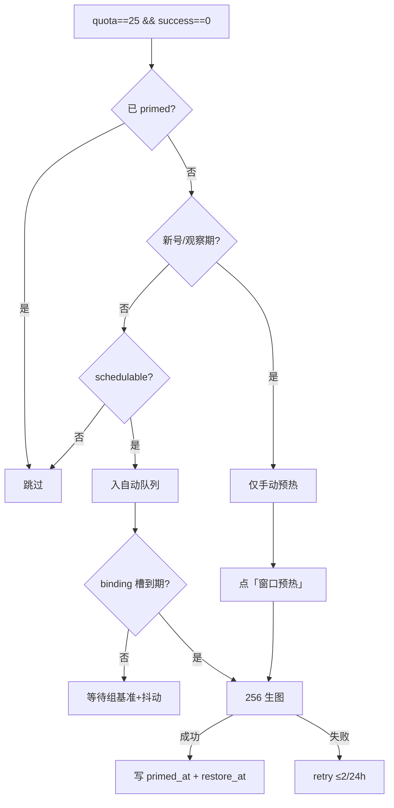

# 32 — 额度刷新日历、窗口预热与 UI 语义（v1 定稿）

最后更新：**2026-07-28 14:30**  
状态：**设计定稿 · 待实现**  
关联：[`quota-semantics.md`](quota-semantics.md)、[`10-human-like-workload-plan.md`](10-human-like-workload-plan.md)、[`26-slot-lifecycle-rust-roadmap.md`](26-slot-lifecycle-rust-roadmap.md)、[`30-throughput-10-plan.md`](30-throughput-10-plan.md)、[`21-image-scheduling-and-pipeline.md`](21-image-scheduling-and-pipeline.md)

---

## 0. 背景与问题

| 现象 | 根因 |
|------|------|
| 额度旁几乎总是「1 分钟内核对」 | `image_quota_refresh_service` **每 60s** 对全池可调度号 `fetch_remote_info` |
| F5 后 `restore_at` / 核对时间像「刚刚」 | 非 F5 触发；是后台刚刷完 + UI 未区分「核对时间」与「窗口结束」 |
| quota=25 时「恢复时间」无意义或跟探测漂 | 满额未进周期时 `reset_after` 无稳定锚点；有额度时列名误导（实为**窗口结束**） |
| 自动化风险 | 60s × N 号 ≈ 持续 `/conversation/init` 探活 |

**目标**：用 **binding 级四段日历刷新** 替代 60s 全扫；用 **一次性窗口预热** 给满额新周期号钉锚点；UI 展示上游真实字段语义。

### 优化要点速览（v1.1）

| 维度 | 决定 |
|------|------|
| 刷新频率 | 每号 **4 次/天**（四段日历）；事件驱动即时；**不再** 60s 全池 |
| 预热频率 | 每号 **终身 1 次自动**；失败 **≤2 次/24h**；手动不限次数但需 admin |
| 预热尺寸 | **256×256** + `quality=low`（上游允许最小档） |
| 跳过新号 | staging/ready、入库 **<7 天**、incoming → **仅手动**可预热 |
| 按 IP 频率 | 同 **binding** 串行；组基准 + 30–60min 账号抖动；全局并发 **1–2** |
| 手动入口 | 号池行 **「窗口预热」** + `POST /api/accounts/quota-window/prime` |
| Rust | **已实现** `binding_calendar` + `quota_schedule` FFI；trace 22–25 |
| 架构 | 走现有 `image_tasks` 管线；`task_kind=quota_prime` 低优先级旁路 |

---

## 1. 术语（UI 与字段）

| 字段 | 上游来源 | 含义 | UI 文案（quota>0） | UI 文案（quota=0） |
|------|----------|------|-------------------|-------------------|
| `last_quota_refresh_at` | 本地写入 | 上次成功拉 limits 的时刻 | 「X 分钟前核对」 | 同左 |
| `restore_at` | `limits_progress.image_gen.reset_after` | 上游窗口结束/恢复时刻 | **窗口结束** | **预计恢复** |
| `quota_window_primed_at` | 本地（新） | 预热生图完成时刻 | 小标「已预热」 | — |
| `next_quota_refresh_at` | 本地计算（新） | 下一计划 limits 刷新 | 「下次核对 HH:MM」 | 同左 |

详见 [`quota-semantics.md`](quota-semantics.md) §「窗口结束 vs 预计恢复」。

---

## 2. 替换 60s 全池刷新：Binding 四段日历

### 2.1 规则

- 一天按 **出口时区**（`resolve_account_tz_name`，默认 `Asia/Singapore`）切成 **4 段**：`[0,6) [6,12) [12,18) [18,24)` 小时。
- 每段每 **binding** 刷新 **1 次** → 每号每天 **4 次** limits 拉取（经账号归属 binding）。
- **组级基准时刻**（同 binding 同段同天稳定）：
  ```text
  u = stable_hash(binding_key, local_date, phase_index, "refresh-slot")
  slot_in_phase = phase_start + u * phase_duration
  ```
- **账号级抖动**：在组基准上再加 `30–60` 分钟（可配置），由 `stable_hash(account_key, …)` 决定，**同 IP 组内相关、跨组无关**：
  ```text
  jitter_min = 30 + stable_hash(account_key, local_date, phase_index) * 30  # 分钟
  account_slot = binding_slot + timedelta(minutes=jitter_min)
  ```

### 2.2 仍须即时刷新的路径（不变）

| 触发 | 事件名 | 说明 |
|------|--------|------|
| 生图成功/失败后 | `image_quota_refresh:queued` | 现有 `schedule_refresh` |
| 取号懒刷新 | `lazy_quota_window_refresh` | quota=0 且 restore 已过 |
| 新入库 / 首次 verified | `quota_refresh:initial` | 仅一次 |
| restore_at 前 30–60min | `quota_refresh:pre_restore` | 仅 quota=0，可选 |
| **手动** | `quota_refresh:manual` | 号池行内按钮 |

### 2.3 关闭/合并的冗余机制

| 机制 | 处置 |
|------|------|
| `image_quota_refresh_service._tick` 全池扫描 | **删除**，仅保留 `schedule_refresh` 队列 |
| `proactive_refresh` | **关闭**或改为仅 token keepalive（不拉 limits） |
| `image_quota_freshness_hours` / `require_quota_freshness` | **关闭**；调度以 `mark_image_result` 本地扣减为准 |

### 2.4 `proactive_refresh` 是什么（给运维）

历史「拟人探活」：每 60s tick，每号每天最多 1 次，在工作日 9–17 随机时刻 `fetch_remote_info`。  
与新四段方案 **职责重叠** → 上线 32 后 **disable**。

---

## 3. 额度窗口预热（Quota Window Prime）

### 3.1 目的

对 **从未进入额度周期** 的满额号，打 **1 张最小生图**，让上游返回稳定 `reset_after`，避免「窗口结束」列无锚点。

### 3.2 自动预热准入（全部满足）

| # | 条件 |
|---|------|
| 1 | `quota == 25`（精确满额设计值，可配置 `quota_window_prime_full_quota`） |
| 2 | `success == 0`（从未成功生图） |
| 3 | 无 `quota_window_primed_at` |
| 4 | `image_schedulable == true` |
| 5 | 非 Pro/ProLite、非 `image_quota_unknown` |
| 6 | **非新号**（见 §3.3） |
| 7 | （可选）无 `restore_at` / `image_gen_window_reset_at` 锚点 |

**`quota < 25` 不自动预热** — 已在周期内或状态异常。

### 3.3 跳过新号（自动预热）

下列任一则 **跳过自动预热**（仍可 **手动预热**）：

| 标志 | 说明 |
|------|------|
| `panda_sync_state` ∈ `{staging, ready}` 且未 `synced` | 注册/入库观察期 |
| `created_at` 距今 < **7 天**（可配置 `quota_prime_min_account_age_days`） | 新号冷却 |
| `panda_receive_state == incoming` | 未验收 |
| `identity_isolated` / `status` ∈ `{禁用, 异常}` | 不可用 |

新号在观察期结束后，若仍 `quota==25 && success==0`，进入预热候选。

### 3.4 预热执行

| 项 | 值 |
|----|-----|
| 路径 | 内部低优先级 `image_tasks`（`client_task_id=prime-{token_prefix}`） |
| 尺寸 | **256×256**（或上游允许最小档） |
| quality | `low` / `auto` 最低 |
| prompt | 固定极简（如白底马克杯剪影），禁止随机长 prompt |
| 并发 | 全局 **1–2**；**同 binding 串行**（与 IP 频率一致） |
| 频率 | **每号终身 1 次自动**；失败最多重试 **2 次 / 24h** |
| 成功后 | `fetch_remote_info` → 写 `quota_window_primed_at`、`restore_at` 快照 |

### 3.5 按 IP（binding）频率

与四段刷新共用 **binding 日历**，并与养号矩阵（`ip_nurture_schedule`）**错峰**：

| 约束 | 值 | 说明 |
|------|-----|------|
| 同 binding 并发 | **1** | 预热 + limits 刷新不同时打同一出口 |
| 同 binding 日内间隔 | **≥2h** | 多号排队：组基准 + 账号抖动，禁止同秒齐刷 |
| 全局预热并发 | **1–2** | `prime_max_inflight`；不占满 `image_global_concurrency` |
| 自动预热时段 | 第一段 `[0,6)` 本地 | 避开养号高峰（`business_hours` 9–17）与用户 conc10 |
| 与 limits 刷新 | **互斥** | 同 binding 若 15min 内有 `quota_refresh` due，预热顺延 |

算法复用 `humanlike_scheduler._stable_u`（与 `decide_proactive_refresh` 同族，salt 改为 `quota-prime-v1` / `quota-refresh-v1`）：

```text
binding_slot = phase_start + stable_u(binding_key, date, phase) * phase_duration
account_slot = binding_slot + timedelta(min=30..90 from stable_u(account_key, date, phase))
```

不同 binding 哈希独立；`proxy_binding_max_accounts=2` 时同 IP 最多 2 号仍按账号槽排队，**不会** 2 号同时预热。

### 3.5b 自动 vs 手动决策流



---

| 层 | 设计 |
|----|------|
| API | `POST /api/accounts/quota-window/prime` body: `{ access_tokens: [...] }` 或单号 `preferred_account_email` |
| 权限 | admin |
| 行为 | 立即入预热队列，**绕过**日历等待；可对新号/观察期号强制执行（`force: true` 二次确认） |
| UI | 号池行「操作」区按钮 **「窗口预热」**；批量：勾选多行 → 工具栏「批量窗口预热」 |
| 状态 | `none` 显示按钮；`pending/running` 禁用+「预热中」；`done` 显示「已预热」+ 时间；`failed` 红色+ tooltip `quota_window_prime_last_error` |
| 与正式生图 | 独立队列权重；**低于** conc10 / 用户任务；`prime_max_inflight` cap |

**UI 线框（accounts/page.tsx 操作列）**：

```text
[ 刷新额度 ] [ 窗口预热 ] [ 更多 ▾ ]
                    ↑
         quota_window_prime_state === 'done' → 文案「已预热 07-28」
         staging 且未 force → disabled + tooltip「新号观察期，可强制预热」
```

---

## 4. 架构分层

```text
┌─────────────────────────────────────────────────────────────┐
│  Web UI（accounts/page.tsx）                                 │
│  · 额度 + 「X分钟前核对」                                     │
│  · 窗口结束 / 预计恢复 + restore_at 原值                      │
│  · 手动「窗口预热」按钮                                       │
└───────────────────────────┬─────────────────────────────────┘
                            │ REST
┌───────────────────────────▼─────────────────────────────────┐
│  api/accounts.py — quota_refresh + quota_window_prime          │
└───────────────────────────┬─────────────────────────────────┘
                            │
        ┌───────────────────┼───────────────────┐
        ▼                   ▼                   ▼
┌───────────────┐  ┌────────────────┐  ┌──────────────────────┐
│ quota_refresh │  │ quota_window   │  │ account_service      │
│ _schedule_svc │  │ _prime_service │  │ mark_image_result    │
│ (新，替 60s)   │  │ (新)           │  │ fetch_remote_info    │
└───────┬───────┘  └───────┬────────┘  └──────────┬───────────┘
        │                  │                       │
        │    Rust binding_calendar（FFI 单一真相源）     │
        ▼                  ▼                       ▼
┌─────────────────────────────────────────────────────────────┐
│  image_task_service + orchestrator（正式管线）                 │
│  · prime 任务：priority=PRIME，size=256，binding 串行          │
│  · 事件驱动 refresh 仍走 schedule_refresh 队列                 │
└───────────────────────────┬─────────────────────────────────┘
                            │
┌───────────────────────────▼─────────────────────────────────┐
│  Rust（现有 + 扩展）                                          │
│  · schedule_trace：emit quota_refresh_*, prime_* 事件          │
│  · image_schedule_core：可选 Phase2 排期 FFI                   │
│  · 不参与 limits HTTP；仍不持 quota 状态                       │
└─────────────────────────────────────────────────────────────┘
```

### 4.1 与 image pipeline 的关系

- 预热任务走 **同一** `image_tasks` DB 与 orchestrator，避免第二条 HTTP 生图链路。
- `image_task_service` 增加 `task_kind: "quota_prime"`；调度器 **preflight 降权**，不占满 `image_global_concurrency`（建议 `prime_max_inflight=1`）。
- 预热 **不** 触发 conc10 验收口径；`schedule_trace` 打标 `source=quota_prime` 便于甘特过滤。

### 4.2 与调度/Rust 的关系

| 组件 | 职责 |
|------|------|
| Python `quota_refresh_schedule_service` | 日历 tick（60s 仅检查 due slot，不扫全池）、执行 `fetch_remote_info` |
| Python `quota_window_prime_service` | 候选筛选、入队、状态机 |
| `humanlike_scheduler._stable_u` | 组槽 + 账号抖动（与 proactive 同算法族，不同 salt） |
| `ip_nurture_schedule` | 养号权重矩阵；预热时段避开 `business_hours` 高峰 |
| `account_lease_pool` / `SlotLedger` | 预热仍走 `acquire_ss`；`task_kind=quota_prime` 不计入 conc10 验收 in-flight 统计 |
| Rust `schedule_trace` | 可观测：`|quota_refresh|prime|` 事件进 trace，conc10 报告可排除 |
| Rust `image_schedule_core`（可选 L2） | FFI `binding_refresh_slots(date, tz) -> [(binding, phase, utc_ts)]` 批量算槽，减 Python 扫全池 |
| `aci_ranker` / 取号 | 不因预热改变；预热号 success 后 quota=24，正常参与调度 |

### 4.3 与现有服务的替换关系

| 现有 | 32 上线后 |
|------|-----------|
| `image_quota_refresh_service._tick` 全池 | **删除**；保留 `schedule_refresh` 事件队列 |
| `proactive_refresh_loop_service` | **disable**；limits 职责并入四段日历 |
| `image_pipeline.require_quota_freshness` | **false**；调度信本地 `mark_image_result` |
| `account_maintenance_loop`（若仅刷额度） | 不重复启用 |

### 4.4 频率总表（运维一眼看懂）

| 动作 | 每账号 | 每 binding | 全池 |
|------|--------|------------|------|
| limits 刷新（日历） | 4 次/天 | 4×账号数次/天（串行间隔 ≥2h） | ~4N 次/天（N=可调度号） |
| limits 刷新（事件） | 生图后 + 懒刷新 + 手动 | — | 随负载 |
| 自动预热 | **1 次终身** | 同 binding 串行 | 全局 1–2 并发 |
| 手动预热 | 不限（admin） | 仍受 binding 串行 | 同自动 cap |
| proactive（旧） | ~~1 次/天~~ | — | **关闭** |

对比现状：60s × N ≈ **1440N 次/天** limits 探活 → 32 方案约 **4N + 事件**，降幅 **>99%** 空载探活。

---

## 5. Rust 结合路线（**已实现核心**）

### 已实现（`image_schedule_core`）

| 模块 | 路径 | 职责 |
|------|------|------|
| `binding_calendar` | `crates/image_schedule_core/src/binding_calendar.rs` | `stable_u`、四段槽位、`next_slot`（与 Python `_stable_u` 黄金向量对齐） |
| `quota_schedule` | `crates/image_schedule_core/src/quota_schedule.rs` | 批量 `evaluate_pick`：due 账号 + binding gap |
| FFI | `isc_binding_calendar_*` / `isc_quota_schedule_evaluate` | Python `services/image_pipeline/binding_calendar.py` 薄封装 |
| trace | `image_schedule_trace` | `quota_refresh_*` / `quota_prime_*` 事件 id 22–25 |

Python 服务层 **只做 I/O**：`fetch_remote_info`、账号字段读写、预热入 `image_tasks`；**不算槽位**。

构建：`python scripts/build_schedule_trace.py` → `native/libimage_schedule_core.so`（或 `.dll`）。

### Phase 2（可选扩展）

- ~~预热准入规则 `quota_prime_evaluate` 迁入 Rust~~ **已实现** `quota_prime.rs` + `isc_quota_prime_evaluate`
- Ops UI 日历预览直接读 `GET /api/ops/quota-schedule/preview`

### Phase 3（不做）

- Rust **不** 直接调 OpenAI limits；HTTP 仍在 Python `openai_backend_api`。

---

## 6. 配置草案（`config.json`）

```json
{
  "quota_refresh_schedule": {
    "enabled": true,
    "phases_per_day": 4,
    "default_timezone": "Asia/Singapore",
    "timezone_from_egress": true,
    "account_jitter_min_minutes": 30,
    "account_jitter_max_minutes": 60,
    "tick_sec": 60,
    "pre_restore_refresh_minutes": 45
  },
  "quota_window_prime": {
    "enabled": true,
    "full_quota": 25,
    "min_account_age_days": 7,
    "image_size": "256x256",
    "image_quality": "low",
    "auto_phase_index": 0,
    "binding_min_gap_hours": 2,
    "max_concurrent_global": 2,
    "max_concurrent_per_binding": 1,
    "max_auto_attempts": 3,
    "retry_interval_hours": 24,
    "skip_panda_sync_states": ["staging", "ready"],
    "defer_if_refresh_due_within_minutes": 15
  },
  "image_quota_refresh_interval_sec": null,
  "proactive_refresh": { "enabled": false },
  "image_pipeline": { "require_quota_freshness": false },
  "image_quota_freshness_hours": 0
}
```

---

## 7. UI 变更清单

| 位置 | 变更 |
|------|------|
| 额度列 | 数字 + `formatQuotaRefreshAge(last_quota_refresh_at)` → 「12分钟前核对」 |
| 原「恢复时间」列 | 改名 **「窗口/恢复」**；quota>0 显示「窗口结束」+ 上游 `restore_at`；quota=0「预计恢复」 |
| 预热 | 按钮「窗口预热」；已预热显示「已预热」+ `quota_window_primed_at` |
| tooltip | 展示 ISO：`restore_at`、`last_quota_refresh_at`、`limits reset_after` 原文 |
| 不再 | 把 `last_quota_refresh_at` 误标为恢复时间 |

---

## 8. 账号持久化字段（新增）

```json
{
  "quota_window_primed_at": "ISO8601 | null",
  "quota_window_primed_restore_at": "上游 reset_after 快照 | null",
  "quota_window_prime_attempts": 0,
  "quota_window_prime_last_error": "string | null",
  "quota_window_prime_state": "none | pending | running | done | failed",
  "next_quota_refresh_at": "ISO8601 | null"
}
```

---

## 9. 实现顺序

| 序 | 项 | 依赖 |
|----|-----|------|
| 1 | `quota_refresh_schedule_service` + 关 60s tick | — |
| 2 | 关 proactive + freshness 门禁 | 1 |
| 3 | UI 文案拆分（核对 / 窗口结束 / 预计恢复） | 可并行 |
| 4 | `quota_window_prime_service` + 内部 prime 任务 | 1 |
| 5 | 手动预热 API + UI 按钮 | 4 |
| 6 | `schedule_trace` 事件 + ops status | 4 |
| 7 | Rust `binding_calendar` FFI（可选） | 1 |

---

## 10. 验收

| 检查 | 期望 |
|------|------|
| 连续两次 `GET /api/accounts`（只读） | `restore_at` 不变（无后台 tick 时） |
| 满额未预热号 | 列显示「待预热」或窗口结束为「—」 |
| 预热后 | quota=24，`restore_at` 稳定 24h，不随 F5 滑动 |
| 四段刷新 | 每号每天 ~4 次 `last_quota_refresh_at` 更新 |
| conc10 | 预热 in-flight ≤2，不影响 10/10 |
| 新号 7 天内 | 无自动预热；手动可触发 |

证据目录建议：`docs/captures/quota-schedule/`。

---

## 11. 与 30-throughput-10 的关系

[`30-throughput-10-plan.md`](30-throughput-10-plan.md) §3「60s 循环 + 事件驱动」由 **本文 §2 四段日历 + §3 事件驱动** 替代；`quota.lag_sec` 指标改为「距 `next_quota_refresh_at`」而非 60s 轮询 lag。
