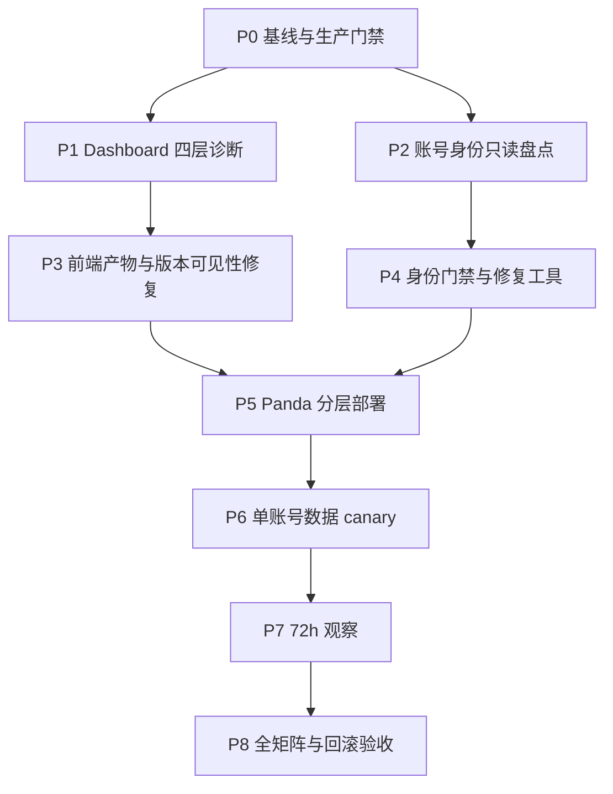

# Dashboard 与 Panda 账号身份证据修复执行计划

> **归档说明（2026-07-20）**：本文件为旧版已大部分执行的计划。未完成项（t24h/t72h 结案、四档截图、API 语义、P8 矩阵）已并入根目录 [`plan.md`](../../plan.md) Track L。请勿再以本文件为主执行清单。

最后更新：2026-07-17（归档日 2026-07-20）

执行目标：修复 Dashboard 两列未显示、Panda 账号代理绑定/出口证据/持久指纹缺失，建立防复发门禁，完成单 canary、72 小时观察和完整测试矩阵验收。
Goal 预算：`900,000,000 tokens`（由 Goal 工具记录实际消耗；本文件负责执行拆解与证据索引）。

---

## 0. 执行 Contract

### 0.1 本轮目标

1. Dashboard 账号表稳定显示 **代理 / 出口**、**累计流量** 两列，并能区分“字段为空”“历史未采集”“已有真实累计值”。
2. 核清 Panda 当前 `18` 条账号的真实代理绑定：解释 `12/18` 同安全签名、修复 `6/18` 缺账号级代理的可恢复记录，并把证据不足记录送入隔离态。
3. 建立注册出口、运行出口和账号持久 fp 的独立证据字段，完成已有账号的证据分级和可审计修复。
4. 把账号身份初始化收敛到单一入口：持久化成功后再创建上游 Session；聊天、生图、刷新、恢复、maintenance、导入路径共享同一门禁。
5. 在 Panda 容量复核通过后按“前端 → 后端单元 → 单账号数据”的顺序发布，每步都有备份、验证和回滚点。
6. 用单账号 canary 观察 `1h / 6h / 24h / 72h`，最后运行功能、数据、故障注入、兼容性、性能和生产证据矩阵。

### 0.2 已知事实

- 本地源码 `web/src/app/accounts/page.tsx` 已存在两列表头和单元格：
  - `代理 / 出口`
  - `累计流量`
- 本地类型 `web/src/lib/api.ts` 已声明 `proxy_egress_ip`、`proxy_egress_hash` 和三项流量字段。
- Panda 页面截图仍显示旧列结构，优先检查静态产物、容器挂载、公共资源 hash 和浏览器缓存链路，而不是重复添加 JSX。
- 用户报告 Panda 根分区已经由 `86.1%` 回落到约 `50%`；生产动作前仍执行一次只读容量预检并保存时间戳证据。
- 最新只读样本为：`12/18` 有账号级代理但安全签名相同，`6/18` 缺代理；注册出口 hash、运行出口 hash、持久 fp 均为 `0/18`；`16/18` 已有使用记录。
- 本地代码已存在 `ensure_complete_fp()` 和 `OpenAIBackendAPI._persist_fp_if_needed()`。生产 `fp=0/18` 说明需要核对部署版本、入口覆盖率、存储回写和异常日志。

### 0.3 证据原则

- 历史未知值保持 `unknown`；当前运行出口与注册时出口分栏记录。
- 代理报告只保存 provider、scope、节点安全 ID、host/port 脱敏值和 hash；密码、token、Cookie、邮箱密码不进入报告。
- “修复成功”以存储重读、进程重启后重读、真实请求复用和公开页面可见四层证据为准。
- 账号身份修复与账号状态恢复分开：补字段不会自动把 invalid、terminal、rejected 账号重新放入调度池。

### 0.4 完成定义

同时满足以下条件后标记 Goal 完成：

- [ ] 公网页面截图可见两列，宽屏展示正常，窄屏横向滚动可达。（chunk 已含两列文案；**登录截图仍缺**）
- [ ] 公网 `/api/accounts` 对目标字段的 null/number/string 语义与前端一致。
- [x] 18 条账号完成代理/出口/fp 证据分级，修复报告总数闭合为 18。（catchup audit A6+E12）
- [x] 活跃账号级代理节点一对一校验通过，重复节点有明确归因和处置状态。（unique rebind 后 v2_unique=18）
- [x] 可恢复账号的 fp 经进程重启仍保持同一 hash；全部上游入口受统一门禁覆盖。（canary fp `b2590affa545` 跨 t0→t14h 稳定）
- [ ] 单 canary 通过 `1h / 6h / 24h / 72h` 观察，出口漂移、fp 漂移和新增终态均为 0。（**仅到 t14h-interim；t24h/t72h 未到**）
- [ ] 测试矩阵关键组合全部通过；报告包含命令、时间、版本/hash、结果和回滚演练证据。

---

## 1. 依赖与执行顺序



切片逻辑：

1. 先证明页面实际服务哪个静态版本，避免把部署漂移误判为 JSX 缺失。
2. 代理相同签名既可能是真共享，也可能是脱敏算法碰撞；先核实再写数据。
3. 先落统一身份门禁和 dry-run 工具，再修生产账号，避免修完又被旧入口覆盖。
4. 前端、后端、数据分别 canary，任何异常都只回滚当前层。
5. 72 小时观察通过后才扩展测试组合和账号范围。

---

## 2. Panda 生产门禁

所有 Panda 动作由单一执行者使用 `panda-remote-ops` 流程完成；其他 subagent 只做本地代码、文档、测试和脱敏报告分析。

### 2.1 只读预检

每次生产变更前保存以下证据：

- 根分区使用率、inode 使用率、`/root/gptimage` 与 Docker 占用。
- 可用内存、总内存、swap、1/5/15 分钟负载和 CPU 核数。
- 容器 health、restart count、OOM、当前 RSS/CPU/PIDs。
- 生图队列、全局/账号 in-flight、后台 maintenance/recovery/import 状态。
- Panda 后端版本、关键 Python 文件 hash、`web_dist` manifest/hash、容器内挂载 hash。
- SQLite integrity check 和账号总数，只输出脱敏统计。

### 2.2 绿色门槛

| 项目 | 进入变更的门槛 |
|---|---|
| 根分区 | 实测 `<80%`；用户报告约 50%需现场确认 |
| inode | `<80%` |
| 可用内存 | `>=1GiB` 且 `>=总内存25%` |
| 归一化 1m load | `<0.70` |
| 容器 | healthy、restart count 稳定、无 OOM |
| 队列 | 无异常槽位泄漏；部署窗口内新任务入口受控 |
| 备份 | web_dist、代码、配置、SQLite 在线备份均完成 |

这些门槛约束 Panda 的部署、接收入库验证、成熟期检查和 live canary。Windows 本地注册资源独立计算；Panda 接收通道暂停时，本地新账号进入 staging 等待，避免形成无观察证据的积压。

### 2.3 立即止损条件

- 根分区回升到 `>=85%` 或 inode 异常增长。
- 可用内存降到 `<1GiB` 或 `<25%`。
- 容器出现 OOM、连续重启、SSH 延迟显著恶化。
- 账号总数、状态数或配额总数出现计划外变化。
- 单 canary 产生代理漂移、fp 漂移、重复请求或新增 terminal。
- API 5xx、图片队列延迟或 in-flight 未回到基线。

触发后停止当前层扩展，执行该层回滚并保存故障快照。

---

## 3. P0：本地基线、版本和备份清单

### 3.1 动作

- [ ] 记录 `git status --short`，标出本轮允许修改的文件和既有脏改。
- [ ] 保存目标文件 hash、当前测试结果和前端静态产物时间。
- [ ] 确认生产使用的 storage backend、SQLite 路径、容器 compose 文件和 `web_dist` 挂载路径。
- [ ] 建立本轮证据目录：`data/runlogs/account-identity-remediation-YYYYMMDD-HHMMSS/`。
- [ ] 为每次生产动作生成 `operation.json`：操作者、时间、版本、变更层、canary ID hash、备份路径、回滚命令和验证结果。

### 3.2 涉及文件

- `plan.md`
- `docs/02-current-state.md`
- `docs/04-improvement-backlog.md`
- `docs/09-outlook-longevity-99-plan.md`
- `docs/logs/2026/2026-07.md`
- `scripts/build_static_frontend.ps1`
- Panda 实际 compose 文件与 storage 配置（只读核对后记录具体路径）

### 3.3 验收证据

- 本地基线测试日志。
- Panda 预检 JSON/Markdown 脱敏报告。
- 四类备份路径及 SHA-256：SQLite、后端文件、配置、`web_dist`。

---

## 4. P1：Dashboard 两列未显示的四层诊断

### 4.1 源码层

- [ ] 确认 `web/src/app/accounts/page.tsx` 表头、单元格和 `min-w` 已包含两列。
- [ ] 确认 `web/src/lib/api.ts` 的 `Account` 类型含：
  - `proxy`
  - `proxy_provider`
  - `proxy_scope`
  - `proxy_egress_ip`
  - `proxy_egress_hash`
  - `traffic_uploaded_bytes`
  - `traffic_downloaded_bytes`
  - `traffic_total_bytes`
  - `traffic_updated_at`
- [ ] 检查表格最小宽度是否覆盖 16 列总宽度；宽屏优先填满左右空间，较窄视口保留横向滚动。

### 4.2 API 层

- [ ] 对脱敏的单条 `/api/accounts` 响应核对字段是否真实返回。
- [ ] 核对 storage → `_normalize_account()` → `list_accounts()` → FastAPI JSON 的完整链路。
- [ ] 验证历史流量 `null` 显示“等待采集”，真实 `0` 显示 `0 B`，正数显示格式化值。
- [ ] 验证代理密码不会通过 API 下发到普通显示组件；编辑功能继续使用管理员权限边界。

### 4.3 静态产物层

- [ ] 执行 `scripts/build_static_frontend.ps1` 生成 `web/out` 和 `web_dist`。
- [ ] 在静态 chunks 内检索两列表头文本和字段名。
- [ ] 生成 `web_dist-manifest.json`：构建时间、Git commit、VERSION、accounts 页面 chunk hash。
- [ ] 比较本地 `web_dist`、Panda 宿主机 `web_dist`、容器 `/app/web_dist` 三层 SHA-256。

### 4.4 公网与浏览器层

- [ ] 记录公网 `/accounts/` HTML 引用的 chunk URL 和内容 hash。
- [ ] 对比截图页面的列序与当前源码列序，确认是否为旧 bundle。
- [ ] 使用全新浏览器上下文加载一次，再使用原浏览器强制刷新一次，区分服务端产物与客户端缓存。
- [ ] 在 `1280 / 1440 / 1920 / 2560` 四档视口截图；检查横向滚动条、固定操作列和列截断。

### 4.5 预期修复

按诊断结果选择最小动作：

1. **Panda 静态目录旧**：重新构建并原子替换 `web_dist`。
2. **容器挂载旧 inode/空目录**：备份后单容器重建，使 `/app/web_dist` 指向新目录。
3. **API 字段缺失**：部署对应后端 account normalization/serialization 代码。
4. **浏览器仍命中旧 chunk**：使用内容 hash 文件名和构建 manifest 验证；新 HTML 引用新 chunk 后复测。
5. **宽度不足**：依据 16 列实际总宽调整 `min-w`，保持横向滚动可达。

### 4.6 文件与测试

| 文件 | 预期动作 |
|---|---|
| `web/src/app/accounts/page.tsx` | 只在宽度/显示语义确有问题时调整 |
| `web/src/lib/api.ts` | 补齐账号字段类型和 null 语义 |
| `scripts/build_static_frontend.ps1` | 输出构建 manifest 与关键 hash |
| `api/system.py` | 可选：暴露前端 build ID 供版本核对 |
| `test/test_account_export.py` 或新增 API contract 测试 | 验证字段存在与脱敏 |

验收：公网新截图中两列表头清晰可见；至少一行分别展示代理状态和流量状态；Network 面板加载的 chunk hash 与发布 manifest 一致。

---

## 5. P2：18 条账号代理、出口和 fp 只读盘点

### 5.1 安全签名核验

`12/18` 相同签名先拆成两个假设：

- H1：12 条账号实际复用了同一个 Webshare endpoint/credential。
- H2：12 条实际 endpoint 不同，但现有签名算法只取 provider/scope 或脱敏后公共部分，造成 hash 碰撞。

执行步骤：

- [ ] 在 Panda 内存与存储快照中读取完整代理值，仅在进程内解析。
- [ ] 规范化为 `scheme + host + port + username/node-id`，密码排除在 hash 输入和输出之外。
- [ ] 同时计算 `legacy_signature` 与 `node_signature_v2`，输出计数和映射关系。
- [ ] 对 v2 签名唯一性、host:port 唯一性、username/node-id 唯一性做交叉表。
- [ ] 报告只保留 hash 前缀和计数。

### 5.2 每账号证据分级

生成 18 行脱敏 inventory，每行归入一个等级：

| 等级 | 条件 | 后续动作 |
|---|---|---|
| A | 有精确注册 manifest、账号代理、注册出口、当前出口、fp | 可进入 canary 候选 |
| B | 有账号代理，缺派生 hash/fp，原始证据可重建 | dry-run 后单行修复 |
| C | 当前缺代理，但 Windows manifest/租约台账能定位原节点 | 恢复原绑定后重新测出口 |
| D | 已使用且缺原节点或注册出口证据 | 隔离并保留取证，不参与调度 |
| E | terminal/invalid/rejected | 保留终态；只补审计字段 |

每行至少包含：

- account token hash、email hash、created_at、last_used_at、success/fail。
- status、panda_receive_state、terminal evidence。
- proxy presence、provider、scope、legacy/v2 node hash。
- registration proxy hash、current egress hash、地区、最后检测时间。
- fp presence、fp hash、fp version、origin、persisted_at。
- storage backend row hash、运行内存 row hash、二者是否一致。

### 5.3 关键判断

- 注册出口 hash 只从注册时 manifest/trace 恢复；当前出口测量结果写入 current egress 字段。
- 对 16 条已有使用记录的账号，fp 原始证据存在时恢复原值；原始证据缺失时生成一次性稳定 fp，并标记 `origin=repair_generated` 与首次生效时间，随后作为隔离 canary 观察。
- 代理相同签名若由算法碰撞造成，修复签名算法并重算；若确认真实共享，同节点账号标记 `binding_violation`，从调度候选移出。
- 6 条缺代理记录只从精确本地 manifest、导入批次或节点租约恢复；证据链缺口写入 `identity_evidence_missing`。

### 5.4 验收证据

- `inventory.json`：18 条闭合，敏感字段泄露数为 0。
- `signature-comparison.json`：legacy/v2 分组差异。
- `repair-classification.md`：A/B/C/D/E 数量之和等于 18。
- SQLite 内存态与持久态 hash 对比报告。

---

## 6. P3：统一账号身份门禁与防复发

### 6.1 统一服务

新增或收敛一个纯后端入口，例如：

```text
AccountRuntimeIdentityService.ensure_ready(access_token, purpose)
```

顺序固定为：

```text
读取账号
→ 规范化代理
→ 验证账号级节点绑定
→ 读取/补齐持久 fp
→ 原子 upsert
→ 从 storage 重读校验
→ 创建 account-scoped Session
→ 执行 chat/image/refresh/recovery 请求
```

持久化失败时返回结构化错误 `account_identity_persist_failed`，账号进入隔离态，Session 创建计数保持 0。

### 6.2 数据字段

至少统一以下字段语义：

```text
proxy
proxy_provider
proxy_scope
proxy_node_hash
proxy_binding_state
proxy_binding_version
registration_proxy_hash
registration_egress_hash
proxy_egress_ip
proxy_egress_hash
proxy_egress_region
proxy_egress_checked_at
fp
fp_hash
fp_version
fp_origin
fp_persisted_at
identity_evidence_state
identity_last_error
```

如 storage 使用 JSON blob，保持字段向后兼容；如建立节点租约表，活跃租约对 `proxy_node_hash` 设置唯一约束并保留历史状态。

### 6.3 入口覆盖

逐项接入统一门禁并写测试：

- [ ] OpenAIBackendAPI 聊天 Session。
- [ ] 生图 conversation、上传、poll、下载各 Session。
- [ ] account refresh / refresh-all。
- [ ] Outlook recovery / re-login。
- [ ] maintenance 与 quota refresh。
- [ ] Panda import-batch / staging ready 转换。
- [ ] Windows 注册结果导出与 Panda 接收 manifest。

资源 Session 与 API Session 继续隔离；每个 Session 都使用同一账号 proxy/fp 基线，资源下载不携带 API Authorization/OAI 头。

### 6.4 写保护

- 账号首次进入 `used` 后，普通 update 接口只允许更新健康、配额、流量和时间字段。
- proxy、registration hash、fp 等身份字段通过专用修复/迁移接口写入，要求 expected version 与审计 reason。
- import-batch 缺 proxy/fp/identity manifest 时进入 staging/隔离，不直接 ready。
- 同一活跃 `proxy_node_hash` 绑定多个账号时触发 `duplicate_active_node`，阻断这些账号进入候选池。
- 每次进程启动运行轻量 identity audit，输出计数并保持零自动改写。

### 6.5 版本漂移检测

- 后端 `/version` 或 health JSON 增加 backend commit/build ID。
- 前端静态 manifest 增加 frontend build ID 和 accounts chunk hash。
- fp 持久化事件包含代码 build ID、入口 purpose、storage backend 和结果。
- Dashboard 管理区显示前后端 build ID；不一致时显示“版本漂移”。

### 6.6 涉及文件

- `services/account_fingerprint.py`
- `services/account_service.py`
- `services/openai_backend_api.py`
- `services/proxy_service.py`
- `services/account_refresh_all_service.py`
- `services/account_maintenance_loop_service.py`
- `services/outlook_account_recovery_service.py`
- `services/panda_staging_service.py`
- `services/register/openai_register.py`
- `services/register/real_browser_register.py`
- `services/storage/database_storage.py`
- `api/accounts.py`
- `api/system.py`
- `web/src/lib/api.ts`
- `web/src/app/accounts/page.tsx`

新模块以最少文件为原则；若统一服务能放入现有 `account_service.py` 并保持职责清晰，则优先减少新增模块。

---

## 7. P4：可审计修复工具

### 7.1 工具形态

新增脚本建议：

```text
scripts/repair_panda_account_identity.py
```

支持三种模式：

```text
audit     只生成 inventory 与分类
canary    只处理一个 token hash，带 expected row hash
apply     按已审核 manifest 逐条处理，每条独立事务
```

### 7.2 输入与输出

输入：

- Panda 脱敏账号快照。
- Windows 注册 manifest/批次台账。
- Webshare 节点租约台账。
- 目标代码/数据版本与 expected hash。

输出：

- `before.json`、`planned.json`、`after.json`。
- 每账号 changed keys、old/new value hash、结果和错误。
- 可逆字段补丁 `rollback.json`。
- 汇总：修复、隔离、终态保留、证据缺失、跳过计数。

### 7.3 应用规则

- 单条账号事务：expected row hash → update → storage 重读 → 内存 reload → 二次重读。
- 每次只处理一个账号；稳定后扩到 2，再扩到剩余可恢复记录。
- 数据修复过程保持图片/文本调度排除，完成校验后由独立 gate 恢复。
- 运行出口测量连续 3 次，记录 IP hash、地区、colo、延迟和一致性。
- fp 持久化后创建两次独立 backend，重启进程后再创建一次，三次 fp hash 相同。

### 7.4 数据修复验收

- 18 条账号分类闭合。
- 所有可调度账号：账号代理、v2 node hash、current egress hash、fp hash覆盖率 100%。
- 完整注册证据覆盖率单独统计；缺历史注册证据的账号保持隔离标识。
- 活跃节点重复绑定数为 0。
- 修复脚本重复执行 changed count 为 0，证明幂等。

---

## 8. P5：本地测试与 Panda 分层部署

### 8.1 本地测试顺序

1. 目标单测：

```powershell
python -m pytest `
  test/test_account_fingerprint_and_proxy_pick.py `
  test/test_account_service_proxy_runtime.py `
  test/test_openai_backend_api_proxy_runtime.py `
  test/test_proxy_health_and_upload.py `
  test/test_panda_staging_service.py -q
```

2. 账号/生图相关回归：

```powershell
python -m pytest `
  test/test_account_image_capabilities.py `
  test/test_account_refresh_all_service.py `
  test/test_account_maintenance_loop_service.py `
  test/test_outlook_account_recovery_api.py `
  test/test_image_task_service.py `
  test/test_v1_images_generations.py `
  test/test_v1_images_edits.py -q
```

3. 编译与前端：

```powershell
python -m compileall api services scripts
powershell -ExecutionPolicy Bypass -File scripts/build_static_frontend.ps1
```

4. 组合回归：运行仓库当前稳定测试集，记录 passed/failed/skipped 和耗时。

### 8.2 部署切片

#### 切片 A：仅前端

- 备份 Panda `web_dist`。
- 上传新目录到 `web_dist_new`，核对 manifest/hash。
- 原子切换目录；如容器挂载仍指向旧 inode，单容器重建。
- 验证 health、首页、accounts 页面和静态 chunks。
- 公网截图确认两列。

#### 切片 B：身份门禁代码

- 备份目标 Python 文件和配置。
- 先在 Panda 容器外执行 import/compile 检查。
- 采用一单元 canary 部署，后台并发设为 1。
- 重启后检查 health、RSS、线程、FD、账号统计和错误日志。

#### 切片 C：单账号数据

- 选择 B/C 类中证据最完整的一条账号。
- 执行 `canary` 模式修复，核对 before/after/rollback。
- 重启或 reload storage 后复核持久态。
- 先保持调度隔离，完成静态验证后再进入 live canary。

### 8.3 发布门禁

每个切片都需要：

- preflight 绿色。
- 备份 hash 有效。
- 本地测试通过。
- 变更文件清单与预期一致。
- canary 验证通过。
- 资源回到基线后再进入下一切片。

---

## 9. P6：单账号 live canary

### 9.1 账号选择

优先级：

1. 精确原节点、注册 manifest、当前出口和 fp 都完整的健康账号。
2. 有精确原节点、经修复后证据完整且当前健康的账号。
3. 若现有 18 条均缺关键历史证据，使用 Windows 本地新注册的 1 条账号，注册到 Panda 全程固定同一 Webshare 节点。

### 9.2 T+0 验证

- storage、内存、API 三处账号 row hash 一致。
- proxy node hash 唯一，三次出口 hash 一致，地区稳定。
- fp hash 在两次 backend 创建间一致。
- Dashboard 显示代理/出口；流量初始值语义正确。
- 从真实队列选择首个聊天或生图请求，保持全局 canary in-flight=1。
- 请求结束后 slot、FD、线程和连接回到基线；累计流量产生非负增量。

### 9.3 扩展条件

单账号 T+0 通过后仍维持一个账号；72 小时结束前不扩第二账号。真实图片队列优先，shadow 调度不会占用小号池图片候选。

---

## 10. P7：1h / 6h / 24h / 72h 观察

每个时间点执行相同的有界只读采集，避免不同口径：

| 时间 | 账号 | 代理/出口 | fp | 请求/流量 | 资源 | 结论 |
|---|---|---|---|---|---|---|
| T+1h | status、quota、terminal | 3次 hash、地区 | hash/version | success/fail、bytes | RSS/FD/线程 | pass/hold/rollback |
| T+6h | 同上 | 同上 | 同上 | 队列、重复数 | load/内存/磁盘 | 同上 |
| T+24h | 同上 | 漂移次数 | 重启后 hash | 真实任务汇总 | 容器 restart/OOM | 同上 |
| T+72h | cohort 终态 | 全周期稳定率 | 全周期稳定率 | 延迟/错误/流量 | 资源趋势 | 最终结论 |

### 10.1 72h 通过标准

- terminal 新增 `0`。
- 代理节点漂移 `0`，运行出口 hash 漂移 `0`。
- fp hash 漂移 `0`，fp 持久化失败 `0`。
- duplicate active node `0`。
- 重复 conversation、重复上游提交 `0`。
- 请求结束后账号/global in-flight 回到 `0`。
- 图片候选数与额度未因 shadow 文本调度减少。
- Dashboard 两列持续可见，流量值单调非减。
- Panda 资源保持绿色，容器 OOM/restart 新增 `0`。

### 10.2 观察产物

```text
data/runlogs/account-identity-remediation-*/
  t0.json
  t1h.json
  t6h.json
  t24h.json
  t72h.json
  screenshots/
  matrix-results.json
  rollback-drill.md
```

---

## 11. P8：最终测试矩阵

测试矩阵删除文本模型工具调用维度，只覆盖账号身份、ChatGPT Web 聊天/生图链路、Dashboard、存储和资源。

### 11.1 Dashboard 矩阵

| 维度 | 组合 |
|---|---|
| 视口 | 1280 / 1440 / 1920 / 2560 |
| 浏览器状态 | 新上下文 / 原上下文刷新 / 重新登录 |
| 代理字段 | 完整 / 仅 host:port / 仅出口 / 全空 |
| 流量字段 | null / 0 / KB / MB / GB |
| 账号状态 | 正常 / 限流 / 异常 / 禁用 / rejected |
| 构建层 | 源码 / 本地 web_dist / Panda 宿主 / 容器 / 公网 |

验收：两列在四档视口均可到达；代理凭据泄露 0；public chunk hash 与 manifest 一致。

### 11.2 代理与出口矩阵

| 维度 | 组合 |
|---|---|
| 账号代理 | 唯一 / 重复 / 缺失 / 格式错误 |
| 签名 | legacy 同签名 / v2 唯一 / v2 重复 |
| 出口 | 3次稳定 / IPv4变化 / 地区变化 / timeout |
| 注册证据 | 完整 / 仅manifest / unknown |
| 生命周期 | 未使用 / 已使用 / terminal |

验收：重复活跃节点全部阻断；历史 unknown 与 current egress 分栏；错误不泄露密码。

### 11.3 fp 与入口矩阵

| 维度 | 组合 |
|---|---|
| fp 初态 | 完整 / 部分 / 空 / legacy arch |
| storage | update成功 / update异常 / 重读不一致 |
| Session | 冷启动 / 同进程复用 / 进程重启 |
| purpose | chat / image / refresh / recovery / maintenance |
| 并发 | 1 / 同账号2请求 / 不同账号2请求 |

验收：成功路径 fp hash 稳定；持久化异常路径 Session 创建 0；账号间 fp/session 不串用。

### 11.4 聊天与生图矩阵

| 通道 | 组合 |
|---|---|
| Chat | `/v1/chat/completions`、`/v1/responses`、`/v1/messages`；stream/non-stream；首轮/续聊 |
| Image | generations、edits、conversation image；同步/异步；单图/多图 |
| 网络 | 正常、连接 timeout、首包 timeout、poll timeout、下载失败 |
| 账号 | healthy、quota=0、limited、invalid、identity隔离 |

验收：账号/节点/fp 使用一致；错误映射明确；重试无重复提交；slot 和连接全部释放。

### 11.5 存储与并发矩阵

- JSON/SQLite 实际生产 backend 对应测试。
- 单账号 upsert、批量 import、reload、进程重启。
- 修复事务中途异常、expected hash 冲突、幂等重跑。
- maintenance/refresh 与修复脚本并发。
- SQLite integrity check、row count 和关键字段覆盖率。

### 11.6 性能矩阵

| 规模 | 并发 | 观察项 |
|---|---:|---|
| 1账号 canary | 1 | CPU、RSS、FD、线程、连接、SQLite写延迟 |
| 2账号本地模拟 | 1/2 | identity lock、Session隔离 |
| 18账号 audit | 1 | 扫描耗时、内存增量、报告大小 |
| Dashboard 18行 | 浏览器1 | 首屏、表格滚动、API payload |

生产保持一单元 canary；多账号并发以本地 mock/fixture 为主，72h 通过后再评估生产扩展。

### 11.7 故障注入矩阵

- storage upsert 抛错。
- storage 写后重读值不一致。
- proxy URL 解析失败。
- duplicate node hash。
- egress 三次测量不一致。
- fp 只含部分字段。
- 后端新版本 + 前端旧 bundle。
- 宿主 `web_dist` 新、容器挂载旧。
- canary 请求 timeout 与进程重启。
- rollback 文件缺失或 hash 不匹配。

每个故障都要验证：状态、错误码、审计事件、资源释放、账号调度结果和敏感信息泄露数。

---

## 12. 回滚计划

### 12.1 前端回滚

1. 校验 `web_dist` 备份 hash。
2. 原子恢复备份目录。
3. 容器挂载需要刷新时只重建 app 单容器。
4. 验证 health、accounts 页面、旧 chunk hash和登录。

目标恢复时间：`<=5分钟`。

### 12.2 后端代码回滚

1. 恢复本轮目标 Python 文件与配置备份。
2. import/compile 检查。
3. 单容器重建。
4. 验证 health、账号计数、队列/in-flight、错误日志。

目标恢复时间：`<=10分钟`。

### 12.3 数据回滚

- 每条修复都依赖 `rollback.json` 和 expected after hash。
- canary 尚未产生上游请求时，可按反向补丁恢复原行。
- canary 已使用新持久身份后，保留新证据并转隔离态，避免再次切换身份；回滚代码与账号数据分开处理。
- SQLite 级回滚使用在线备份恢复到新文件，integrity check 和 row count 通过后再切换。
- 节点租约回滚保持历史记录，状态改为 rolled_back/released，不覆盖审计链。

### 12.4 回滚演练验收

- 前端回滚演练一次。
- 后端单文件/单容器回滚演练一次。
- 单账号 dry-run → apply → rollback → reapply 幂等演练一次。
- 演练全过程敏感信息泄露 0，账号数和状态数计划外变化 0。

---

## 13. Subagent 分工与结果复核

最多维持 3 个执行 subagent + 1 个根协调者，按文件边界减少冲突：

| 角色 | 任务 | 文件边界 | 交付物 |
|---|---|---|---|
| Agent A | Dashboard/静态产物/版本链 | `web/**`、构建脚本、UI测试 | diff、build日志、chunk hash、截图 |
| Agent B | 代理/出口/fp 数据与统一门禁 | `services/**`、`api/accounts.py` | inventory schema、代码diff、目标测试 |
| Agent C | 修复脚本与测试矩阵 | `scripts/**`、`test/**` | dry-run报告、矩阵结果、故障注入 |
| Root | 集成、Panda操作、canary、72h与最终验收 | 生产与文档 | preflight、备份、部署、观察、总报告 |

### 13.1 Subagent 回报格式

每个结果必须包含：

1. 实际修改文件。
2. 核心设计与已排除假设。
3. 精确测试命令、exit code、passed/failed/skipped。
4. 未解决项与生产风险。
5. `git diff --check` 结果。
6. 证据文件路径。

### 13.2 根协调者复核

- [ ] 阅读真实 diff，不以摘要代替代码检查。
- [ ] 检查 subagent 是否越过文件边界或覆盖既有脏改。
- [ ] 独立重跑每个目标测试。
- [ ] 合并后重跑组合回归与前端 build。
- [ ] 对 inventory、修复计数和 18 条闭合做独立计算。
- [ ] Panda 只保留一个远端操作流，避免多 agent 同时改生产。
- [ ] 生产 canary 前再次读取本计划的门禁和回滚段落。

---

## 14. 验收证据清单

| 编号 | 证据 | 通过标准 |
|---|---|---|
| E01 | Panda capacity preflight | 磁盘、内存、负载、容器全部绿色 |
| E02 | 前端 build manifest | 本地/宿主/容器/公网 hash一致 |
| E03 | Dashboard 截图 | 两列可见，四档视口通过 |
| E04 | API contract | 字段完整、null语义正确、凭据泄露0 |
| E05 | 18账号 inventory | 总数闭合，分类清晰 |
| E06 | 签名对比 | 解释12条同签名是真共享或算法碰撞 |
| E07 | 缺代理处置 | 6条逐条有恢复或隔离结论 |
| E08 | 出口证据 | 可调度账号 current egress覆盖100% |
| E09 | fp证据 | 可调度账号持久fp覆盖100%，重启稳定 |
| E10 | 入口覆盖测试 | chat/image/refresh/recovery/maintenance全部受门禁 |
| E11 | 修复幂等 | 二次运行 changed=0 |
| E12 | 单canary T+0 | 请求、流量、资源、身份全部正常 |
| E13 | 72h报告 | 漂移0、terminal新增0、资源异常0 |
| E14 | 最终测试矩阵 | 关键组合全通过 |
| E15 | 回滚演练 | 10分钟内恢复且数据闭合 |

最关键验收：**同一个 canary 在进程重启前后保持同一账号节点 hash、出口 hash 和 fp hash，同时 Dashboard 显示正确代理/流量，真实请求结束后资源与 slot 回到基线。**

---

## 15. 状态板

| 阶段 | 状态 | 完成证据 |
|---|---|---|
| 计划重写 | completed | 本文件 |
| P0 基线/门禁 | completed | 深检 + catchup `…plan-catchup-20260717-140508/preflight.txt`：根分区 **50%**、inode 11%、avail mem ~1.7Gi、load 0.18、容器无 OOM |
| P1 Dashboard 诊断 | near-done | 公网 chunk 含「代理/出口」「累计流量」（catchup `public-column-markers.json`）；traffic 值仍多为 null；**四档视口登录截图仍待** |
| P2 身份盘点 | completed | 原 `…panda18-refresh/` + 独立代理后 catchup audit：**v2_unique=18**、`shared_bindings={}`（`unique-proxy-rebind-20260717-030453`）；分级 **A6+E12** 闭合 18 |
| P3 统一门禁 | local-completed | 同上；另落地 poll budget / started_at / body_shape；refresh 保 isolation |
| P4 修复工具 | completed | canary/apply + unique proxy rebind；活跃绑定一对一已落地 |
| P5 分层部署 | near-done | operation/hash/公网 chunk 对账完成；登录态四档截图仍待 |
| P6 单canary | t0-passed | `40de2f…`；T+0 live 曾 me_ok；后续 `/me` 403 与额度耗尽→限流已记入观察证据；**fp/egress 仍稳定** |
| P7 72h观察 | running | t0/t1h/t6h/t8h + **t14h-interim**；catchup `p7-drift-report.md` identity verdict=pass；**官方 t24h cron=2026-07-18 00:41 +0800，t72h=2026-07-20 00:41 +0800** |
| P8 总矩阵/回滚 | partial | 本地 suite 全绿；Panda `rollback-drill.md` 已演练；生产功能矩阵待 t24h 后扩 |

### 15.1 2026-07-17 14:05 catchup 已执行

证据目录：`/root/gptimage/data/runlogs/account-identity-remediation-plan-catchup-20260717-140508/`

- [x] P0 容量预检（磁盘/内存/负载/容器）
- [x] SQLite integrity + 账号数 18
- [x] 独立代理后 identity audit（A6+E12，v2_unique=18）
- [x] 公网 accounts chunk 两列标记复核
- [x] canary `t14h-interim` 观察 + 漂移报告刷新
- [ ] t24h / t72h（墙钟未到，cron 已挂）
- [ ] 登录态 1280/1440/1920/2560 截图
- [ ] P8 生产功能矩阵（依赖 t24h）

状态只在证据文件落盘后更新；“代码已写”“部署命令已执行”单独不足以标记完成。
